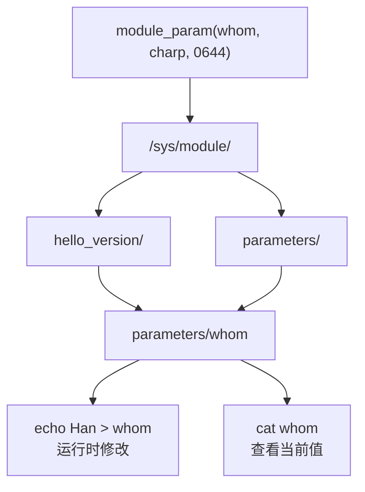
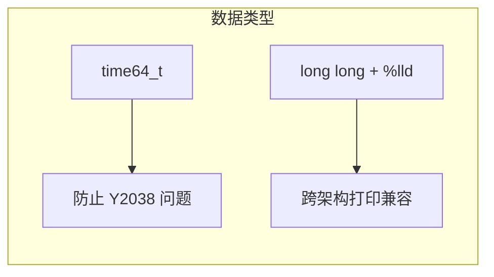

# Writing Modules

## 实验目标

实现一个带模块参数、内核版本检测和运行时长统计的 Linux 内核模块。

## 知识点

- Out-of-tree 模块编译（Kbuild dual-pass Makefile）
- `module_init` / `module_exit` 生命周期
- `MODULE_LICENSE("GPL")` 与 GPL 符号导出机制
- `module_param` 与 Sysfs 参数接口
- `ktime_get_seconds()` / `time64_t` 时间统计
- `utsname()->release` 获取运行时内核版本

## 代码结构图解

### 模块生命周期


### Out-of-tree 双遍 Makefile 编译流程


### 模块参数 Sysfs 导出路径



## 代码说明

| 文件 | 说明 |
|------|------|
| `code/hello_version.c` | 内核模块源码 |
| `code/Makefile` | Out-of-tree 构建脚本 |
| `code/Kconfig` | 内核配置选项（树内编译时使用） |
| `code/Makefile.kernel` | 内核源码 `drivers/misc/Makefile` 追加行 |

> 注：Kconfig 和 Makefile.kernel 为**树内编译**（In-tree）方式所需。Out-of-tree 编译只需 `hello_version.c` 和 `code/Makefile`。

## 树内编译追加内容

**`drivers/misc/Kconfig`**（在 `endif # MISC_DEVICES` 之前插入）：
```kconfig
config HELLO_VERSION
    tristate "Hello Version Module (Bootlin Lab)"
    ---help---
      This is a simple hello world module with parameters and time tracking
      developed during the Bootlin Embedded Linux training.
```

**`drivers/misc/Makefile`**（追加一行）：
```makefile
obj-$(CONFIG_HELLO_VERSION) += hello_version.o
```

## 构建与运行

```bash
# 编译模块
make

# 验证产物架构
file hello_version.ko
# 预期输出: ELF 32-bit LSB, ARM, relocatable

# 传输到开发板后加载
adb push hello_version.ko /root/
adb shell insmod /root/hello_version.ko
adb shell dmesg | tail

# 带参数加载
adb shell insmod /root/hello_version.ko whom=World howmany=3

# 运行时修改参数（Sysfs）
adb shell echo Han > /sys/module/hello_version/parameters/whom
adb shell cat /sys/module/hello_version/parameters/whom

# 卸载并查看存活时长
adb shell rmmod hello_version
adb shell dmesg | tail
```

## 关键设计



| 设计点 | 说明 |
|--------|------|
| `time64_t` | 64 位时间戳，防止 32 位平台 Y2038 溢出 |
| `(long long)` + `%lld` | 强制 64 位打印，兼容 32/64 位架构 |
| `utsname()->release` | **运行时**获取内核版本，不可用编译期宏 |
