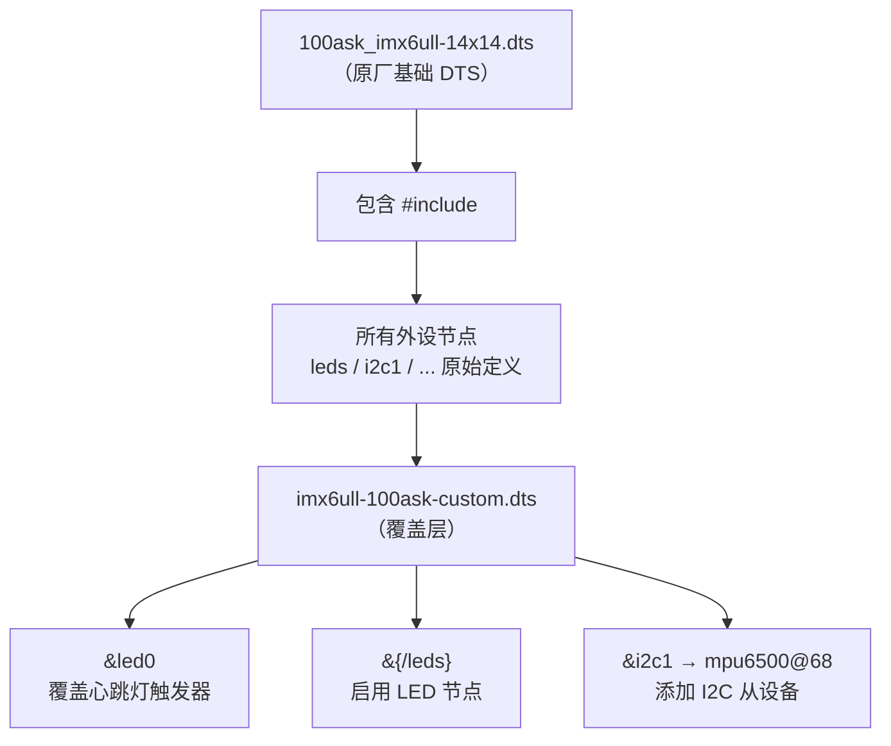
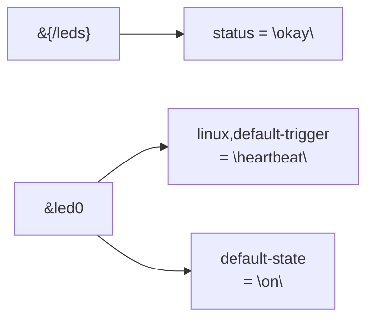
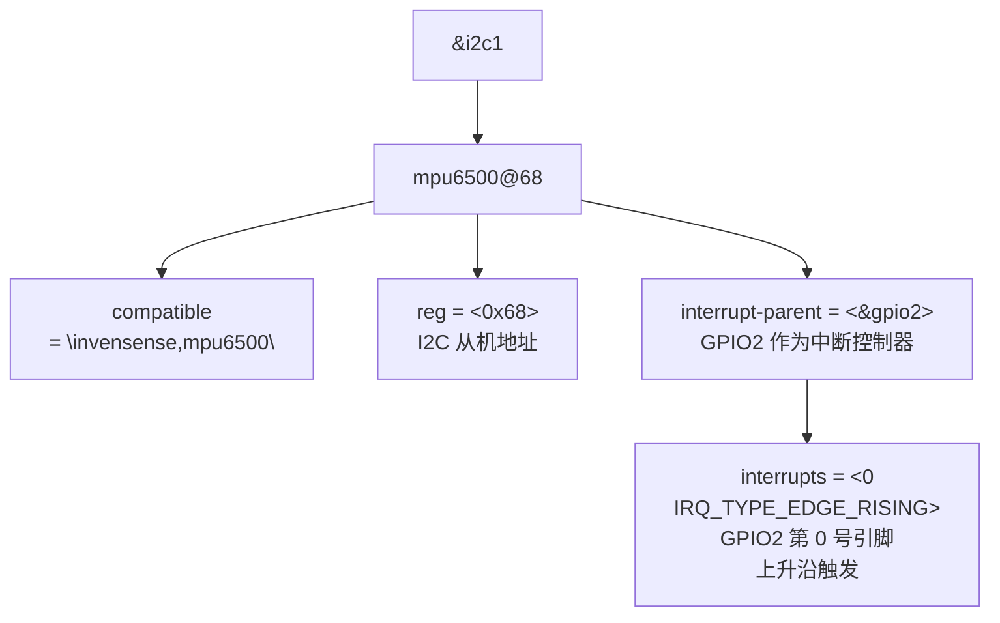
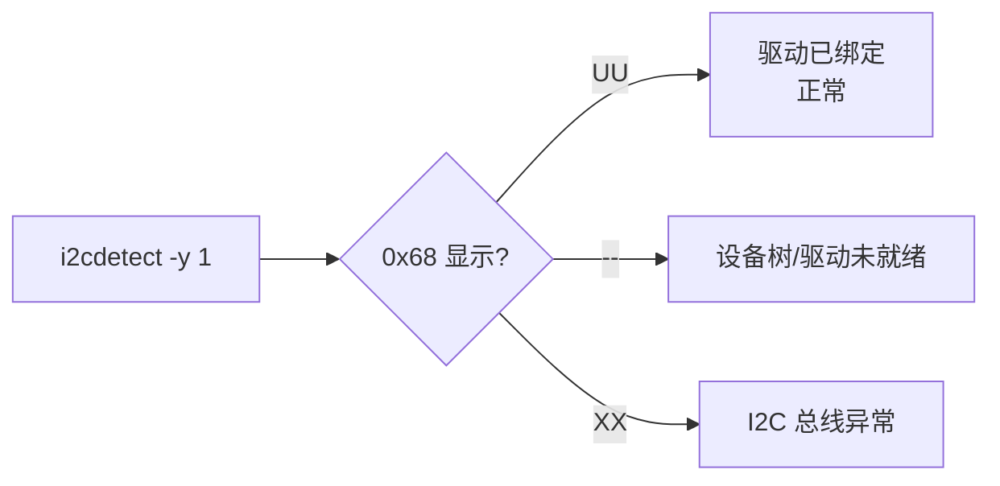

# Describing Hardware Devices

## 实验目标

通过修改设备树，在现有硬件描述中声明 MPU6500 加速度计和配置用户 LED，验证 Device Tree `&label` 覆盖语法和 GPIO/中断属性。

## 知识点

- `&label` 语法：引用已有设备树节点并覆盖属性
- `/delete-property/` 语法：删除从父节点继承的属性
- GPIO LED 控制：`&{/leds}` / `&led0` 节点覆盖
- I2C 子设备声明：`mpu6500@68` 子节点，`reg = <0x68>`
- `interrupt-parent` / `interrupts`：GPIO 中断配置
- `IRQ_TYPE_EDGE_RISING` / `IRQ_TYPE_EDGE_FALLING`：中断触发边沿

## 代码结构图解

### 设备树覆盖原理



### LED 节点覆盖流程



### MPU6500 设备树节点解析



## 代码说明

| 文件 | 说明 |
|------|------|
| `code/imx6ull-100ask-custom.dts` | 设备树片段（覆盖 LED + 声明 MPU6500） |

## 内核 Makefile 追加

**`arch/arm/boot/dts/Makefile`**（在 `dtb-$(CONFIG_SOC_IMX6ULL)` 列表中追加）：
```makefile
dtb-$(CONFIG_SOC_IMX6ULL) += \
    100ask_imx6ull-14x14.dtb \
    imx6ull-100ask-custom.dtb \   # <-- 追加此行
```

> 注：若 `make dtbs` 后未生成 `.dtb` 文件，先检查是否已追加此行。

## 设备树关键修改

```dts
/* 启用 LED 设备树节点 */
&{/leds} {
    status = "okay";
};

&led0 {
    linux,default-trigger = "heartbeat";
    default-state = "on";
};

/* 在 I2C1 总线上声明 MPU6500 */
&i2c1 {
    mpu6500@68 {
        compatible = "invensense,mpu6500";  /* 匹配内核 mpu6050 驱动 */
        reg = <0x68>;                      /* I2C 地址 0x68 (AD0 接地) */

        /* GPIO2 PIN0 作为中断信号（驱动需要，即使轮询模式也要求） */
        interrupt-parent = <&gpio2>;
        interrupts = <0 IRQ_TYPE_EDGE_RISING>;
    };
};
```

## 验证

```bash
# 编译设备树（从 Linux 内核源码根目录）
make dtbs

# 确认生成的 .dtb 文件
ls arch/arm/boot/dts/imx6ull-100ask-custom.dtb

# 推送到开发板并重启
adb push arch/arm/boot/dts/imx6ull-100ask-custom.dtb /boot/
adb shell reboot

# 重启后验证 LED（心跳灯闪烁）
# 验证 MPU6500 被内核驱动识别
adb shell dmesg | grep -i mpu
adb shell i2cdetect -y 1
# 预期：0x68 处显示 inv-mpu6050 驱动名或 "UU"（被占用）
```

## 关键设计

| 设计点 | 说明 |
|--------|------|
| `compatible = "invensense,mpu6500"` | 匹配内核内置 `inv-mpu6050-i2c` 驱动，无需自写驱动 |
| `reg = <0x68>` | I2C 从机地址：0x68 = 十进制 104 = AD0 接地 |
| `interrupt-parent = <&gpio2>` | 指定 GPIO2 作为中断控制器 |
| `interrupts = <0 IRQ_TYPE_EDGE_RISING>` | GPIO2 第 0 号引脚，上升沿触发 |


