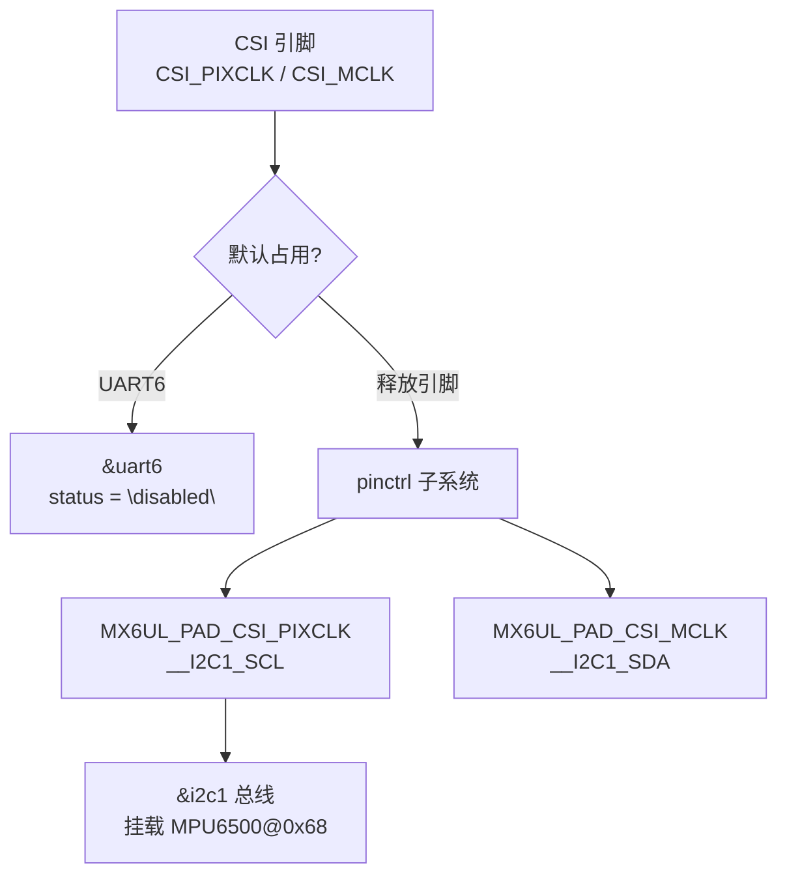
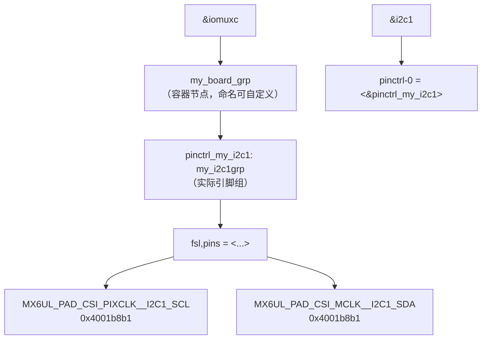
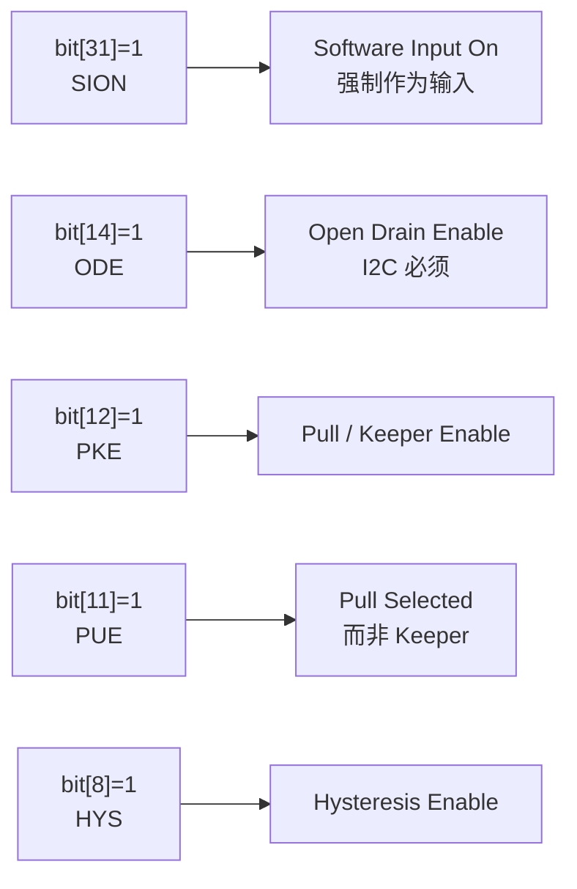

# Configuring Pin Multiplexing

## 实验目标

通过 pinctrl 子系统将 I2C1 复用至 CSI 摄像头引脚（而非默认引脚），解决 CSI 引脚与 UART6 的引脚冲突，并验证 NXP 两级 pinctrl 节点结构。

## 知识点

- NXP i.MX6ULL pinctrl 两级节点结构：`container_node` → `actual_pin_group`
- `MX6UL_PAD_CSI_PIXCLK__I2C1_SCL` / `MX6UL_PAD_CSI_MCLK__I2C1_SDA`：引脚宏定义
- Pad 配置值 `0x4001b8b1`：启用开漏 + 内部上拉（I2C 安全配置）
- `/delete-property/`：移除从父节点继承的 pinctrl 属性，避免配置冲突
- `status = "disabled"`：禁用占用引脚的 UART6 节点

## 代码结构图解

### 引脚复用冲突解决流程



### NXP pinctrl 两级节点结构



> 无容器节点时，NXP pinctrl 驱动返回 `-EINVAL`

### 0x4001b8b1 Pad 配置位解构



### I2C 开漏+上拉原理


## 代码说明

| 文件 | 说明 |
|------|------|
| `code/imx6ull-100ask-custom.dts` | 完整设备树（两级 pinctrl + CSI I2C1 + MPU6500） |
| `code/mpu_monitor.sh` | IIO Sysfs 自动检测 + 加速度数据监控脚本 |

## 内核 Makefile 追加

**`arch/arm/boot/dts/Makefile`**（在 `dtb-$(CONFIG_SOC_IMX6ULL)` 列表中追加）：
```makefile
imx6ull-100ask-custom.dtb \
```

## 设备树关键修改

```dts
/* NXP 两级 pinctrl 结构（驱动要求） */
&iomuxc {
    my_board_grp {
        pinctrl_my_i2c1: my_i2c1grp {
            fsl,pins = <
                MX6UL_PAD_CSI_PIXCLK__I2C1_SCL   0x4001b8b1
                MX6UL_PAD_CSI_MCLK__I2C1_SDA     0x4001b8b1
            >;
        };
    };
};

/* 释放 CSI 引脚（与 UART6 冲突） */
&uart6 {
    status = "disabled";
};

/* I2C1 使用自定义 CSI 引脚 */
&i2c1 {
    /delete-property/ pinctrl-names;
    /delete-property/ pinctrl-0;
    pinctrl-names = "default";
    pinctrl-0 = <&pinctrl_my_i2c1>;
    clock-frequency = <100000>;
    status = "okay";
};
```

## 验证

```bash
# 编译设备树
make dtbs

# 部署
adb push arch/arm/boot/dts/imx6ull-100ask-custom.dtb /boot/
adb shell reboot

# 验证 I2C1 在 CSI 引脚上工作
adb shell i2cdetect -y 1
# 预期：0x68 处显示 "UU"（内核 mpu6050 驱动已占用）

# 推送并运行 IIO 监控脚本
adb push mpu_monitor.sh /root/
adb shell chmod +x /root/mpu_monitor.sh
adb shell /root/mpu_monitor.sh
# 输出：X/Y/Z 加速度值（m/s²），每 0.2 秒刷新
```

## 关键设计

| 设计点 | 说明 |
|--------|------|
| 两级节点结构 | `my_board_grp` → `my_i2c1grp`，无容器则 NXP pinctrl 驱动返回 `-EINVAL` |
| `ODE=1`（开漏） | I2C 总线可被任意设备拉低，开漏 + 上拉实现线与逻辑 |
| `/delete-property/` 顺序 | 放在 `&i2c1` 覆盖节点**内部**，在添加新属性之前 |
