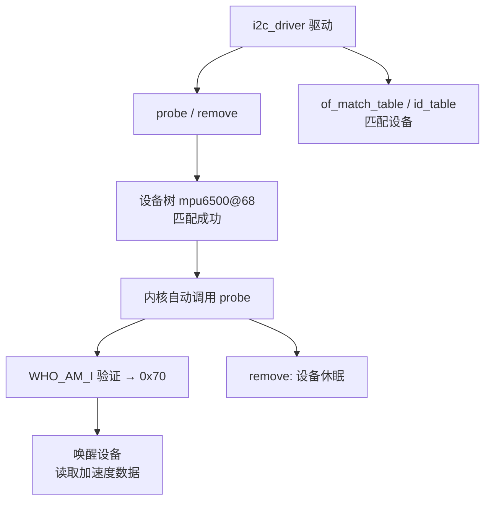
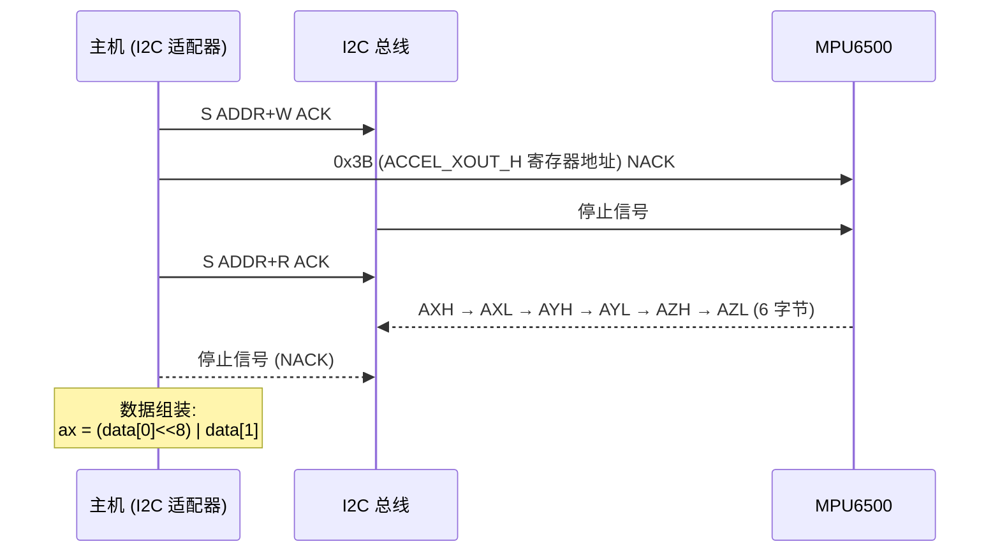
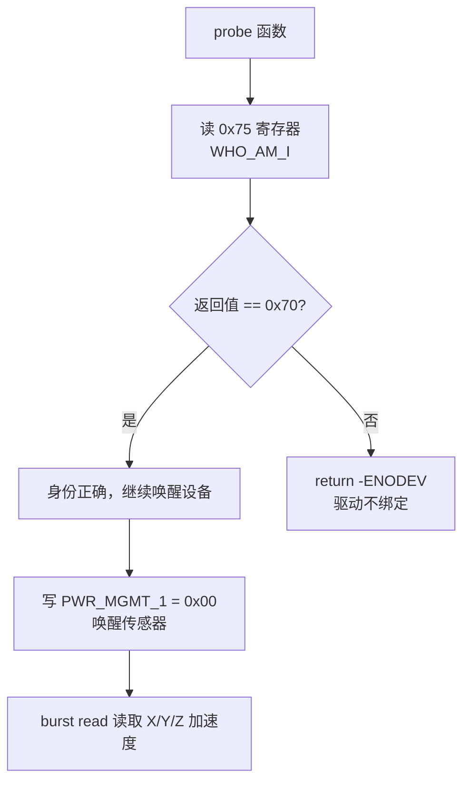
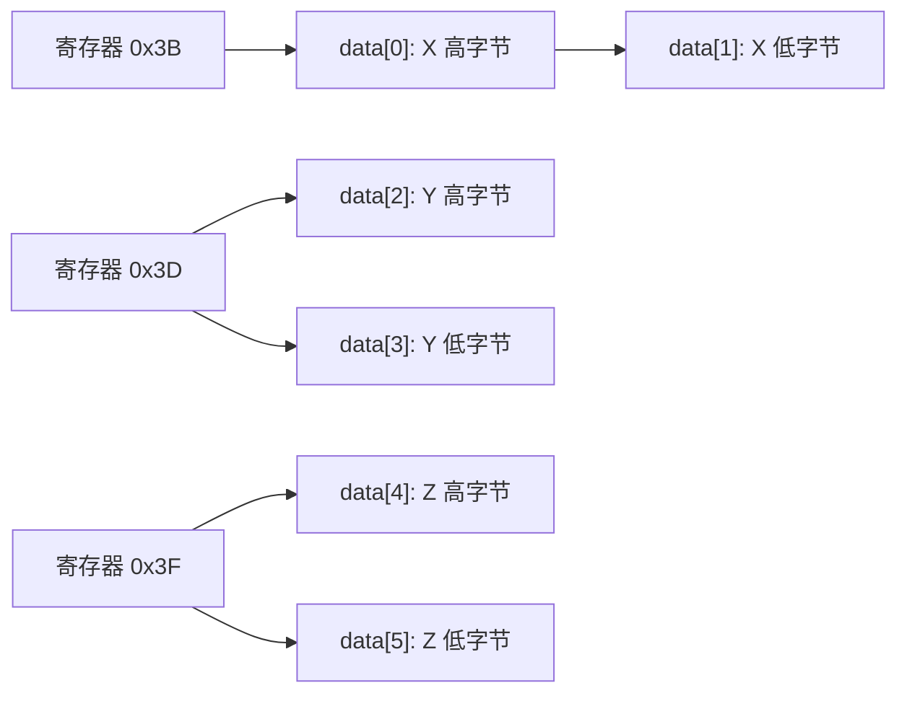

# Using the I2C Bus

## 实验目标

在 I2C 总线上驱动 MPU6500 六轴 IMU，实现裸 I2C 驱动，掌握 `i2c_driver` 框架、burst read 协议和 WHO_AM_I 硬件身份验证。

## 知识点

- `i2c_driver` / `i2c_client` / `i2c_adapter`：I2C 总线驱动模型
- `i2c_transfer` 两消息协议：先发寄存器地址，再读取数据（burst read）
- `i2c_smbus_read_byte_data` / `i2c_smbus_write_byte_data`：SMBus 便捷 API
- WHO_AM_I 寄存器（0x75）验证，期望值 0x70
- Big-Endian 数据组装：高字节在前

## 代码结构图解

### I2C 驱动模型



### Burst Read 两消息协议



### WHO_AM_I 身份验证流程



### Big-Endian 数据组装



## 代码说明

| 文件 | 说明 |
|------|------|
| `code/invensense_mpu6500_i2c.c` | 裸 I2C 驱动（probe 中读取原始数据） |
| `code/Makefile` | Out-of-tree 构建脚本 |

## 验证

```bash
make
adb push invensense_mpu6500_i2c.ko /root/
adb shell insmod /root/invensense_mpu6500_i2c.ko
adb shell dmesg | grep MPU6500
```

## 关键设计

| 设计点 | 说明 |
|--------|------|
| `i2c_transfer` + `i2c_msg[2]` | 显式构造两消息 burst read（写地址 → 读数据） |
| WHO_AM_I 验证 | 读 0x75 寄存器，匹配 0x70 才继续初始化 |
| `module_i2c_driver` | 自动注册/注销驱动模块 |
| Big-Endian | MPU6500 高字节在前：`ax = (data[0] << 8) | data[1]` |
