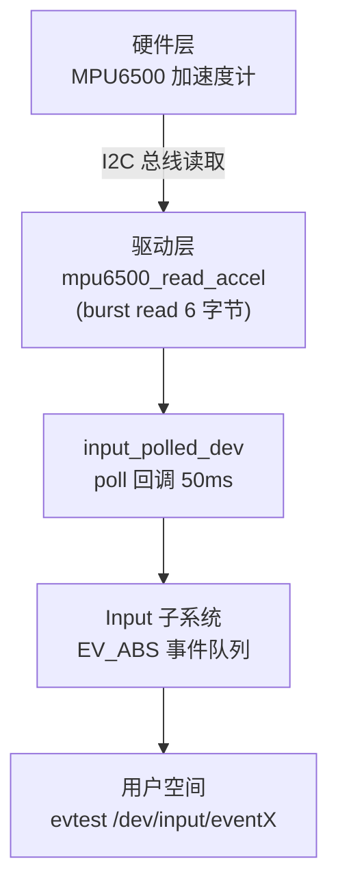
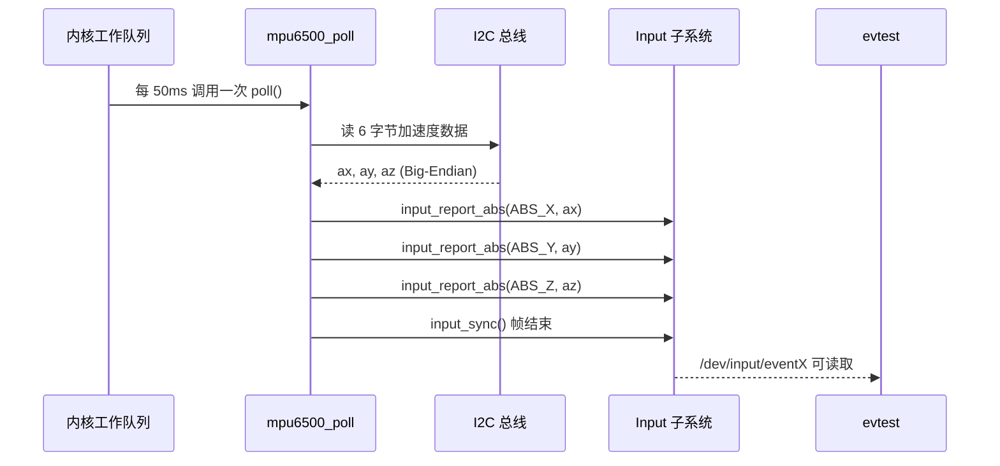
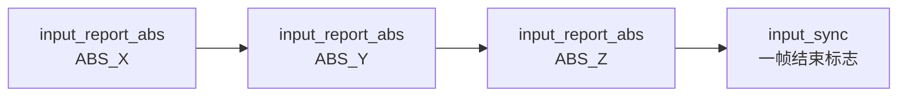
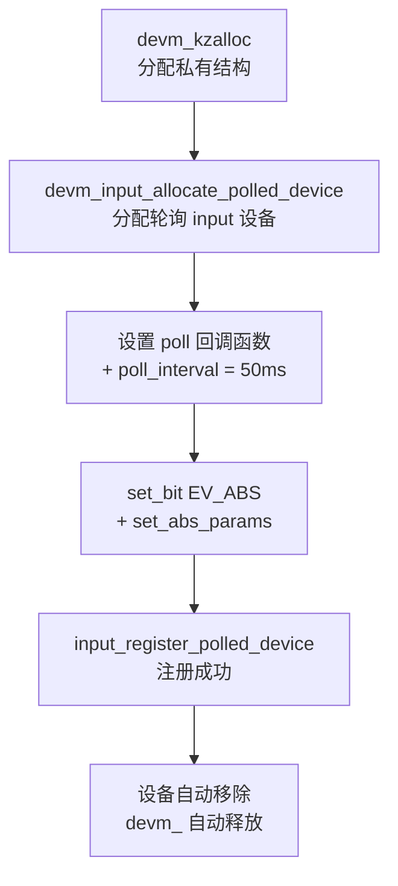

# Input Interface

## 实验目标

将 MPU6500 加速度计桥接到 Linux input 子系统，通过 `input_polled_dev` 框架实现定时轮询上报 X/Y/Z 加速度数据，使标准 input 工具（evtest）可直接读取硬件数据。

## 知识点

- `input_polled_dev` 框架（Linux 4.9 专用）：轮询 input 设备注册
- `EV_ABS` / `ABS_X/Y/Z`：绝对坐标事件类型
- `input_report_abs` / `input_sync`：向 input 子系统报告数据
- Bridge 模式：I2C 物理层 + input 逻辑层
- `input_set_abs_params`：设置事件值的范围和分辨率

## 代码结构图解

### 四层抽象架构



### 数据报告时序



### EV_ABS 事件报告序列



### 设备注册与注销



## 代码说明

| 文件 | 说明 |
|------|------|
| `code/invensense_mpu6500_input.c` | Polled Input 驱动（桥接到 Linux input 子系统） |
| `code/Makefile` | Out-of-tree 构建脚本 |

## 验证

```bash
make
adb push invensense_mpu6500_input.ko /root/
adb shell insmod /root/invensense_mpu6500_input.ko
adb shell dmesg | grep MPU6500

# 查看 input 设备
adb shell ls -l /sys/class/input/

# 用 evtest 读取加速度数据
adb shell evtest /dev/input/eventX
```

## 关键设计

| 设计点 | 说明 |
|--------|------|
| `input_polled_dev` | 内核工作队列定期调度 poll 回调，无需自己管理定时器 |
| `poll_interval = 50` | 50ms 间隔 = 20Hz 采样率 |
| `EV_ABS` + `input_set_abs_params` | 声明绝对坐标事件类型和轴范围 (-32768~32767) |
| `input_sync` | 每帧事件结束标志，通知用户空间数据就绪 |
| `devm_input_allocate_polled_device` | 设备卸载时自动释放，remove 只需休眠硬件 |
