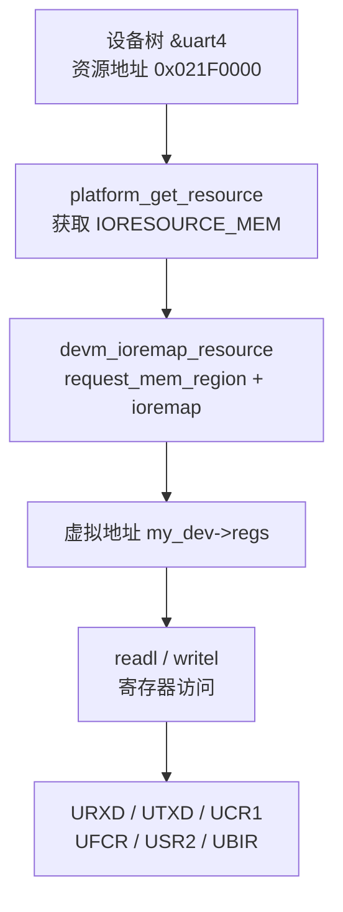
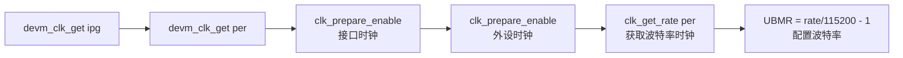
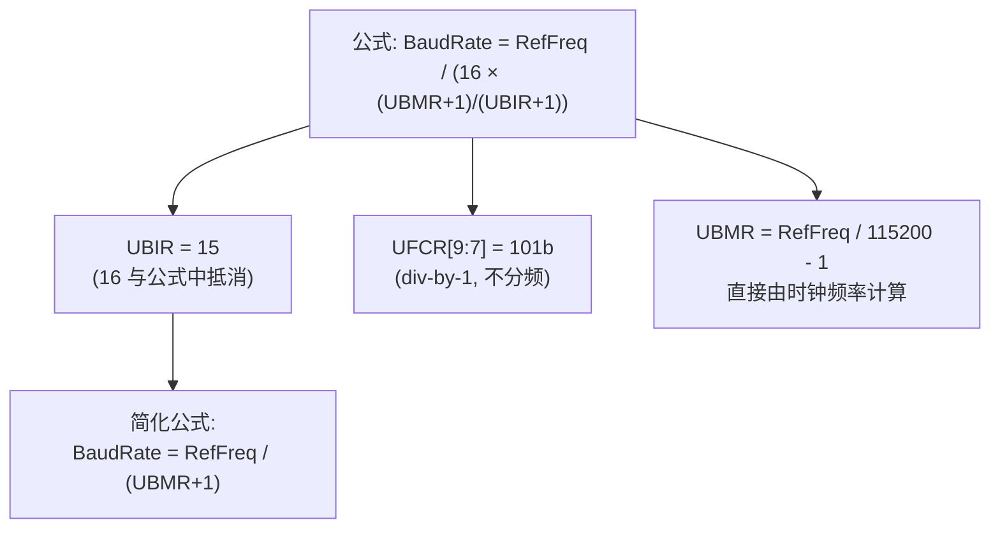
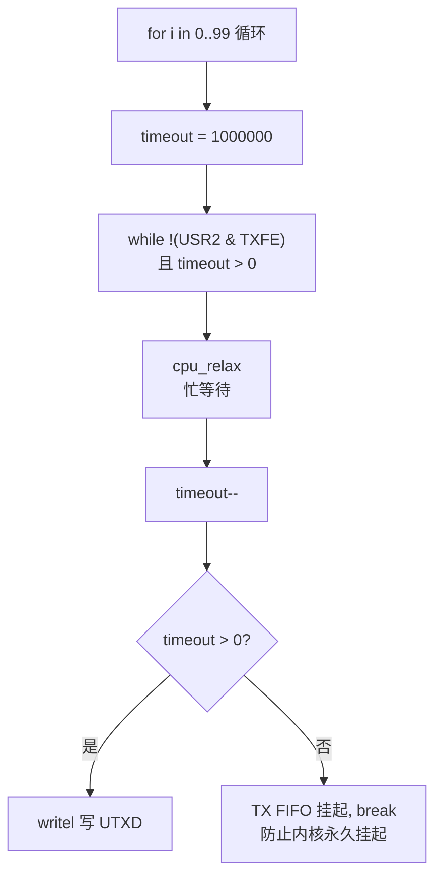

# Accessing I/O Memory and Ports

## 实验目标

通过直接操作 i.MX6ULL UART 寄存器，实现内存映射 I/O、时钟配置、波特率计算，以及 TX FIFO 超时保护轮询发送。

## 知识点

- `ioremap` / `devm_ioremap_resource` 物理地址映射
- `clk_get_rate` / `clk_prepare_enable` 时钟框架
- i.MX6ULL UART 寄存器映射（UCR1/UCR2/UFCR/UBIR/UBMR/USR2）
- 波特率公式：`BaudRate = RefFreq / (16 × (UBMR+1)/(UBIR+1))`
- `cpu_relax` + 超时保护：避免 TX FIFO 死锁

## 代码结构图解

### 内存映射 I/O 流程



### 时钟框架初始化序列



### 波特率计算公式



### TX FIFO 超时保护轮询



## 代码说明

| 文件 | 说明 |
|------|------|
| `code/custom_uart.c` | 驱动源码（probe 中发送 100 字符） |
| `code/Makefile` | Out-of-tree 构建脚本 |
| `code/imx6ull-100ask-custom.dts` | 设备树片段 |

## 波特率配置

```
UBIR = 15 (与公式中 16 抵消)
UBMR = (per_rate / 115200) - 1
UFCR[9:7] = 101b (div-by-1, 不分频)
```

## 验证

```bash
adb push custom_uart.ko /root/
adb shell insmod /root/custom_uart.ko
adb shell dmesg | tail
# 预期：看到 UCR1 initial value 和 "Starting transmission loop"
```

## 关键设计

| 设计点 | 说明 |
|--------|------|
| `devm_ioremap_resource` | 合并 request_mem_region + ioremap，失败返回错误码，无需手动 unmap |
| `cpu_relax()` | 提示编译器这是忙等待，可优化寄存器读取 |
| 超时保护 | 无超时保护时，TX FIFO 硬件卡死将导致内核永久挂起 |
| `compatible = "my,custom-uart"` | 劫持设备树节点，阻止内核默认驱动绑定 |
