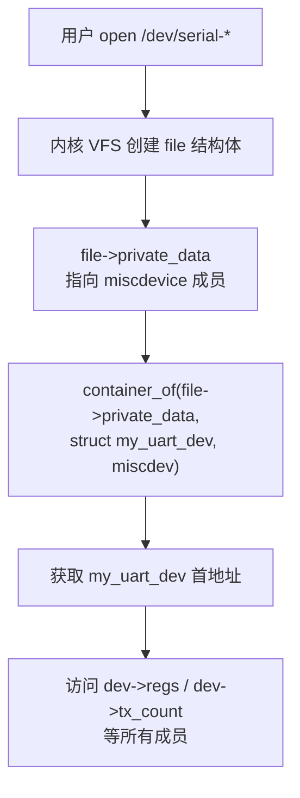
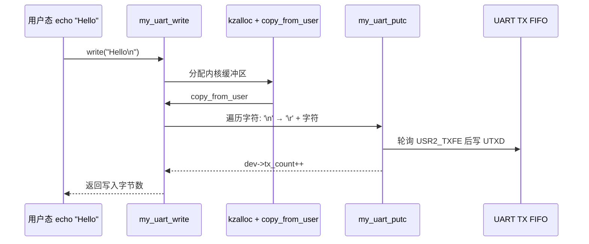
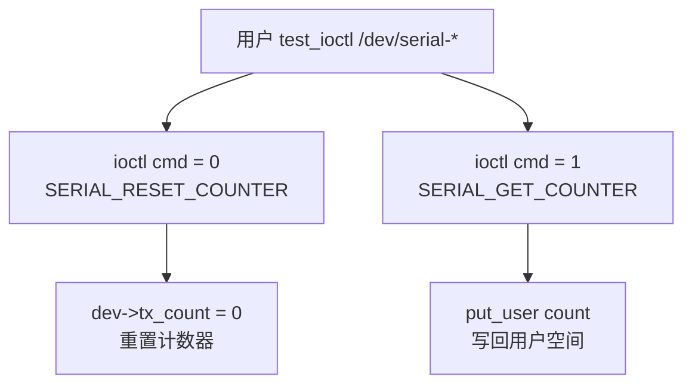
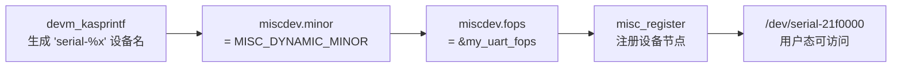

# Output-only Misc Driver

## 实验目标

在实验 3 的基础上，注册 Misc 字符设备，提供 `write` 和 `ioctl` 接口，替代 probe 中的硬编码发字符循环。

## 知识点

- Misc 设备驱动框架（`misc_register`）
- `struct file_operations` 与用户/内核空间数据交换
- `container_of` 宏：通过 `file->private_data` 找回私有设备结构体
- `copy_from_user` / `put_user` 跨空间安全拷贝
- `\n` → `\r\n` 转义（串口终端兼容性）
- 动态设备节点命名（`devm_kasprintf`）

## 代码结构图解

### container_of 反向追溯



### Write 数据流



### IOCTL 接口



### Misc 设备注册



## 代码说明

| 文件 | 说明 |
|------|------|
| `code/custom_uart.c` | 驱动源码 |
| `code/Makefile` | Out-of-tree 构建脚本 |
| `code/test_ioctl.c` | 用户态测试程序（交叉编译） |

## 构建

```bash
# 编译驱动
make

# 交叉编译测试程序
arm-linux-gnueabihf-gcc test_ioctl.c -o test_ioctl -static
```

## 验证流程

```bash
# 加载驱动
adb shell insmod custom_uart.ko
adb shell dmesg | tail

# 查看设备节点
adb shell ls -l /dev/serial-*

# 通过 echo 发送数据
adb shell echo "Hello i.MX6ULL" > /dev/serial-21f0000

# 查看引用计数（Used=1 表示有进程持有）
adb shell lsmod | grep custom_uart

# 测试 IOCTL
adb push test_ioctl /root/
adb shell /root/test_ioctl /dev/serial-21f0000
```

## 关键设计

| 设计点 | 说明 |
|--------|------|
| `misc_register` | 自动分配次设备号，主设备号固定为 10 |
| `container_of` | 从 miscdev 指针反向追溯得到 my_uart_dev 首地址 |
| `\n` → `\r\n` | 串口终端需要回车符，打印换行前先发送 `\r` |
| `devm_kasprintf` | 根据物理基地址动态生成设备名，卸载时自动释放 |
