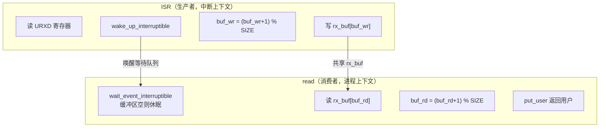
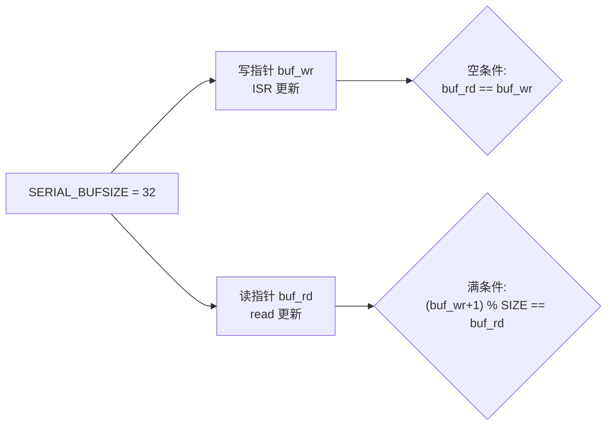
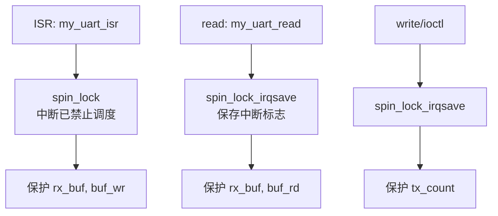
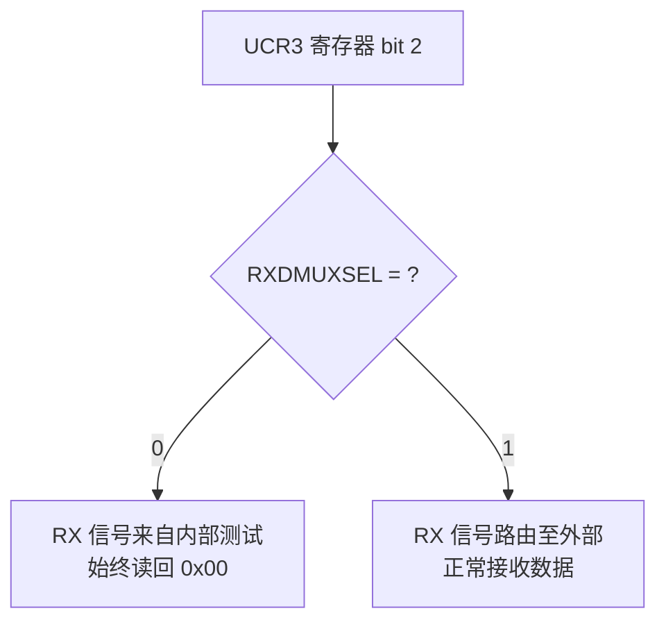

# Sleeping and Handling Interrupts

## 实验目标

添加中断驱动的接收（ISR + Ring Buffer + Wait Queue）和自旋锁保护，实现阻塞读，使串口可被 `cat` 命令实时监听。

## 知识点

- 硬件中断注册：`devm_request_irq`，`irqreturn_t`
- 环形缓冲区（Ring Buffer）：生产者（ISR）/消费者（read）模型
- `wait_event_interruptible`：阻塞读取，ISR 通过 `wake_up_interruptible` 唤醒
- 自旋锁：`spin_lock_irqsave` / `spin_unlock_irqrestore`
- NXP i.MX6ULL 硬件特性：`UCR3_RXDMUXSEL` 位必须置 1

## 代码结构图解

### 生产者/消费者模型



### 环形缓冲区原理



### 自旋锁使用位置



### 三明治原则


### UCR3_RXDMUXSEL 硬件 quirk



## 代码说明

| 文件 | 说明 |
|------|------|
| `code/custom_uart.c` | 完整驱动（含 ISR、Wait Queue、Spinlock） |
| `code/Makefile` | Out-of-tree 构建脚本 |

## 验证

```bash
adb shell insmod /root/custom_uart.ko
adb shell "cat /dev/serial-21f0000 &"
adb shell echo "Test" > /dev/serial-21f0000
adb shell cat /proc/interrupts | grep serial
```

## 关键设计

| 设计点 | 说明 |
|--------|------|
| `spin_lock` in ISR | 中断已禁止调度，无需 irqsave |
| `spin_lock_irqsave` in read | 保存/恢复中断标志，防止死锁 |
| `wait_event_interruptible` | 缓冲区空则休眠，ISR 唤醒后继续 |
| `UCR3_RXDMUXSEL = 1` | 不置 1 外部 RX 信号进不来，始终读 0x00 |
| 三明治原则 | `copy_to/from_user` 和 `GFP_KERNEL` 必须在锁外 |
