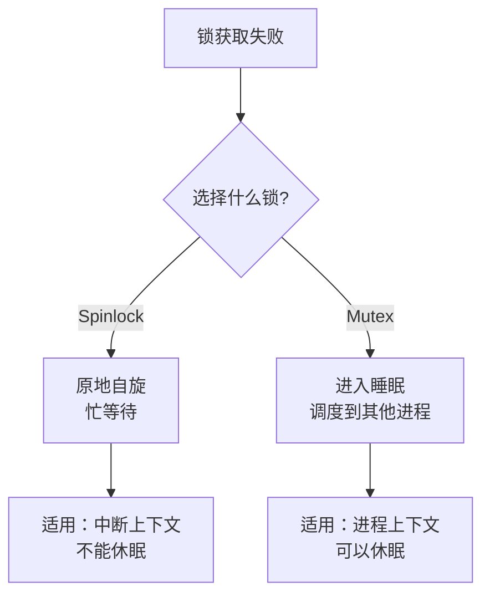
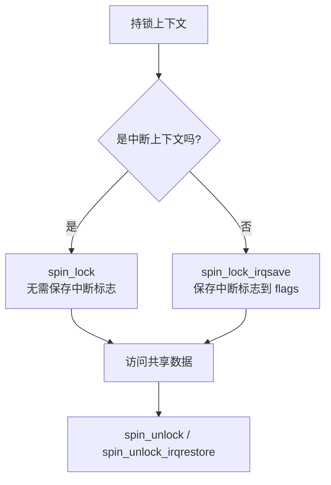
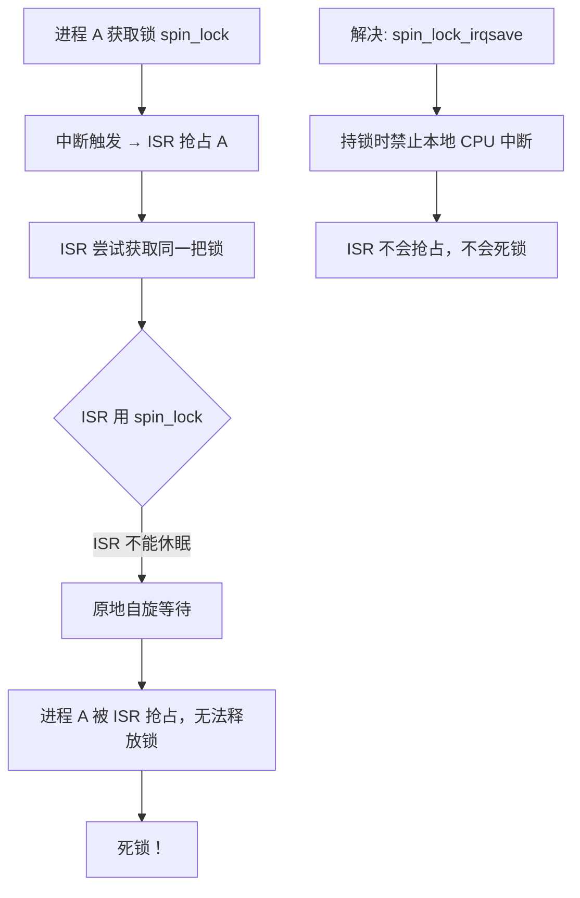
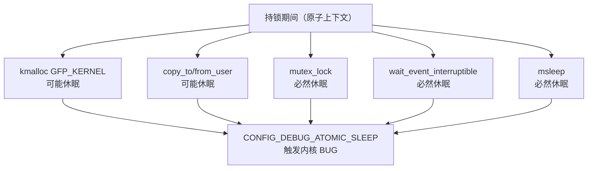

# Locking

## 实验目标

理解内核并发保护的核心机制：自旋锁（Spinlock）在中断上下文与进程上下文之间的使用规则，以及持锁期间禁止休眠的原则。

## 知识点

- Spinlock vs Mutex：适用场景与休眠行为差异
- `spin_lock` / `spin_unlock`：用于 ISR 上下文
- `spin_lock_irqsave` / `spin_unlock_irqrestore`：用于进程上下文
- 中断上下文**绝对不能休眠**：不能调用 `copy_to_user`、`kmalloc(GFP_KERNEL)` 等
- 三明治原则：持锁前完成所有内存分配和数据拷贝

## 代码结构图解

### Spinlock vs Mutex 对比

| 维度 | Spinlock | Mutex |
|------|----------|-------|
| 持锁时休眠 | **不允许** | 允许 |
| 适用上下文 | 中断 + 进程 | 仅进程 |
| 获取失败行为 | 自旋（忙等） | 睡眠（调度） |

### ISR vs 进程上下文用锁差异

### 为什么进程必须用 irqsave

### 三明治原则（原子性保护）

### 持锁期间禁止的 API

## 代码说明

| 文件 | 说明 |
|------|------|
| `code/custom_uart.c` | 完整驱动源码（含自旋锁、ISR + Ring Buffer + Wait Queue） |
| `code/Makefile` | Out-of-tree 构建脚本 |

## 自旋锁使用位置

| 区域 | 保护对象 | 锁类型 |
|------|----------|--------|
| `my_uart_isr` | `rx_buf`, `buf_wr` | `spin_lock` |
| `my_uart_read` | `rx_buf`, `buf_rd` | `spin_lock_irqsave` |
| `my_uart_write` | `tx_count` | `spin_lock_irqsave` |
| `my_uart_ioctl` | `tx_count` | `spin_lock_irqsave` |

## 关键原则

| 原则 | 说明 |
|------|------|
| 持锁期间不分配内存 | `GFP_KERNEL` 分配可能休眠，违反原子性 |
| 持锁期间不拷贝数据 | `copy_to_user` / `copy_from_user` 可能休眠 |
| 中断上下文用 `spin_lock` | 中断已禁止，无需再保存中断状态 |
| 进程上下文用 `spin_lock_irqsave` | 防止进程被中断打断后，中断又去竞争同一把锁（死锁） |
