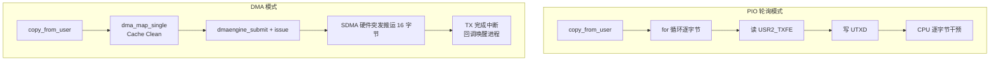
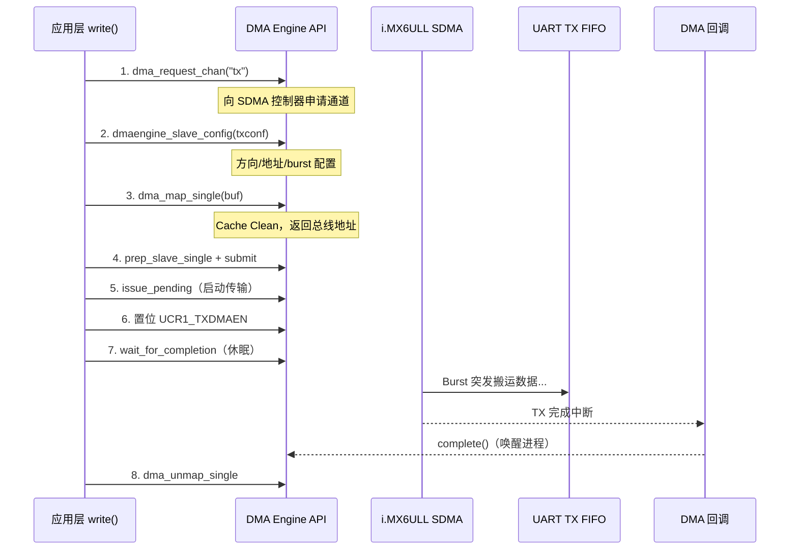
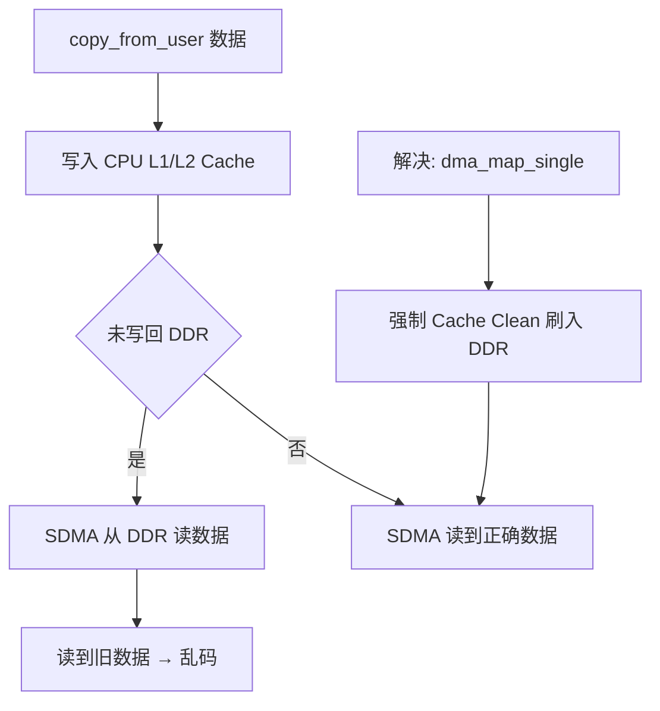
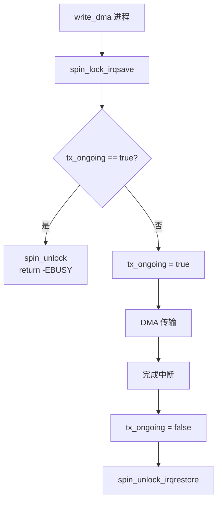
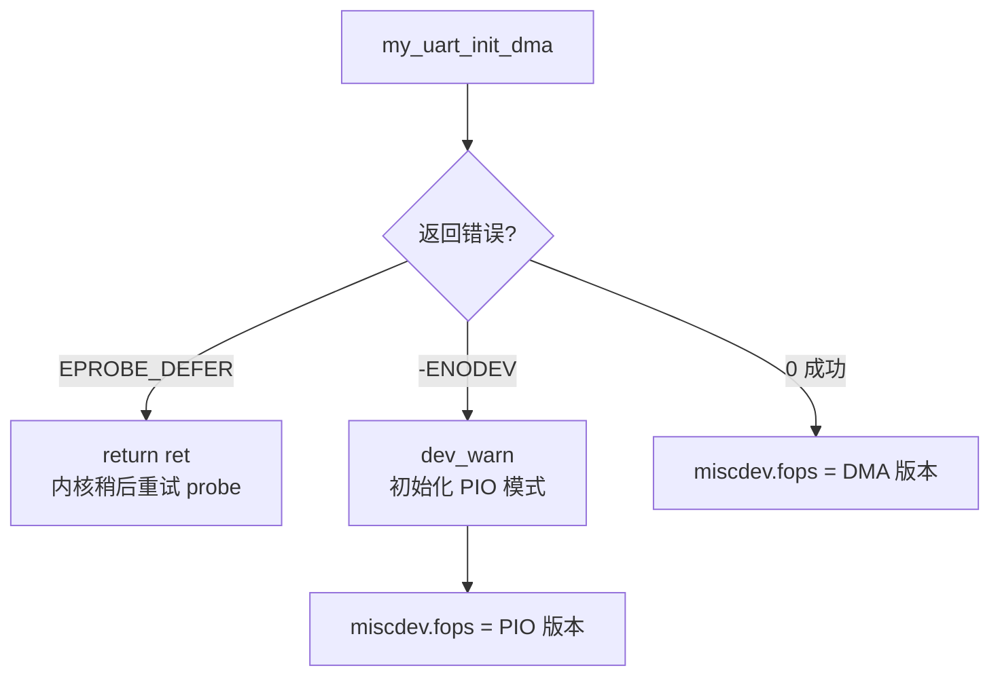

# DMA

## 实验目标

将 UART TX 轮询发送替换为 NXP SDMA 引擎 DMA 发送，实现零拷贝、高效率的 UART 数据传输，同时保留 ISR + Ring Buffer + Wait Queue 的 RX 路径。

## 知识点

- DMA 引擎 API：`dma_request_chan` / `dmaengine_slave_config` / `dmaengine_prep_slave_single` / `dma_async_issue_pending`
- 物理地址获取：`dma_map_resource`（UART TX FIFO 寄存器物理地址）
- 流式 DMA 映射：`dma_map_single` / `dma_unmap_single`
- Completion 同步：`init_completion` / `wait_for_completion` / `complete`
- `EPROBE_DEFER`：SDMA 控制器未就绪时延迟探测
- PIO 回退机制：DMA 通道不可用时自动降级为轮询发送

## 代码结构图解

### DMA vs PIO 数据流对比



### DMA 引擎 API 完整链路



### Cache 一致性问题



### tx_ongoing 防竞争



### PIO Fallback 鲁棒性



### TXTL 水位线与 dst_maxburst 关系

| TXTL | FIFO 空位 | 触发时机 | 推荐 dst_maxburst |
|------|-----------|----------|------------------|
| 2 | 30 | 快空时才申请 | ≤ 30 |
| **16** | **16** | **空一半时申请** | **≤ 16（最优）** |
| 31 | 1 | 有空间即申请 | 只能 1 |

## 代码说明

| 文件 | 说明 |
|------|------|
| `code/custom_uart_dma.c` | 完整驱动（含 SDMA TX + ISR RX + PIO 回退） |
| `code/Makefile` | Out-of-tree 构建脚本 |

## 验证

```bash
make
adb shell insmod /root/custom_uart_dma.ko
adb shell dmesg | grep -E "SDMA|UART"
# 预期之一: NXP SDMA TX channel configured successfully!
# 预期之一: TX DMA channel unavailable, using PIO.

adb shell "cat /dev/serial-21f0000 &"
adb shell echo "DMA test" > /dev/serial-21f0000
adb shell cat /proc/interrupts | grep serial
```

## 关键设计

| 设计点 | 说明 |
|--------|------|
| `dma_map_resource` | UART TX FIFO 物理地址 → DMA 可访问的总线地址 |
| `EPROBE_DEFER` | SDMA 未就绪时返回此错误，内核稍后重新探测 |
| `tx_ongoing + spin_lock` | 防止应用层同时调用 DMA 和 PIO write 竞争 |
| `reinit_completion` | 每次 DMA 前重置 completion，确保 wait_for_completion 正确等待 |
| `UCR1_TXDMAEN = (1 << 3)` | 写入后再等 completion，避免 TX 中断在回调前到达 |
| `TXTL=16 + burst=16` | SDMA 和 UART FIFO 完美匹配，避免饥饿或溢出 |
