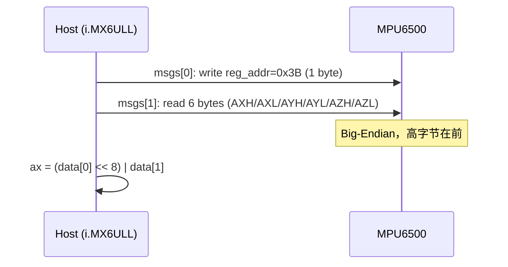
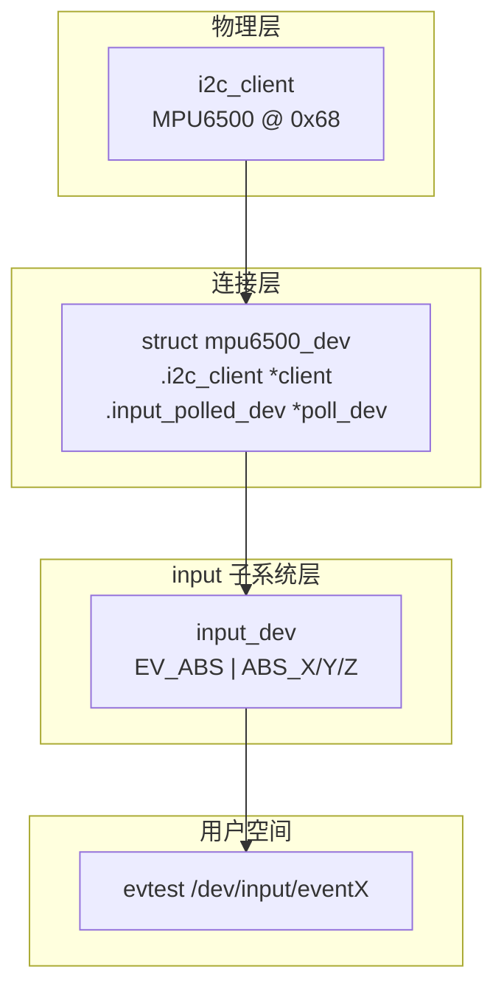
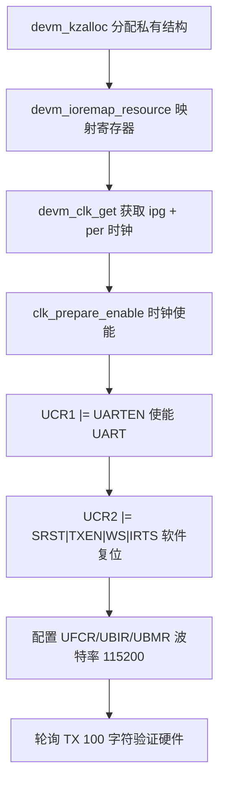
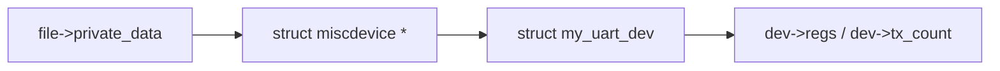
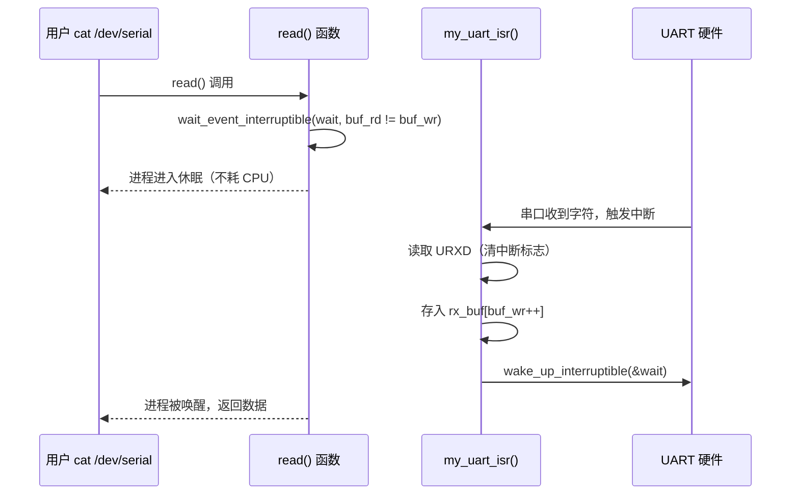
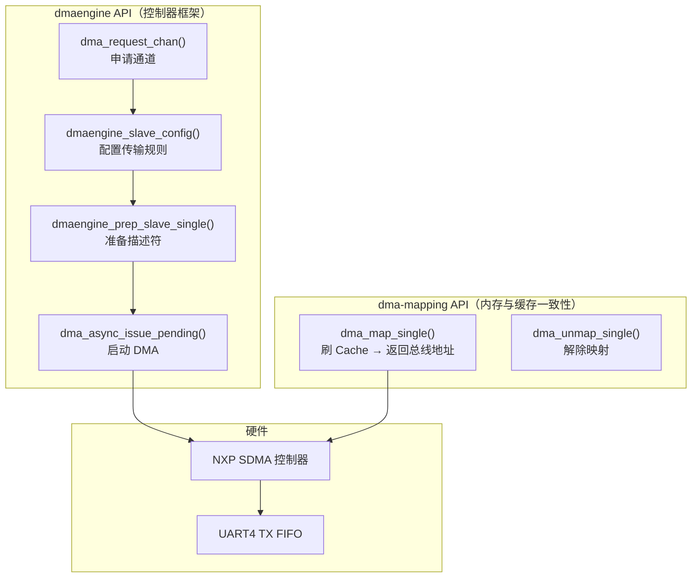
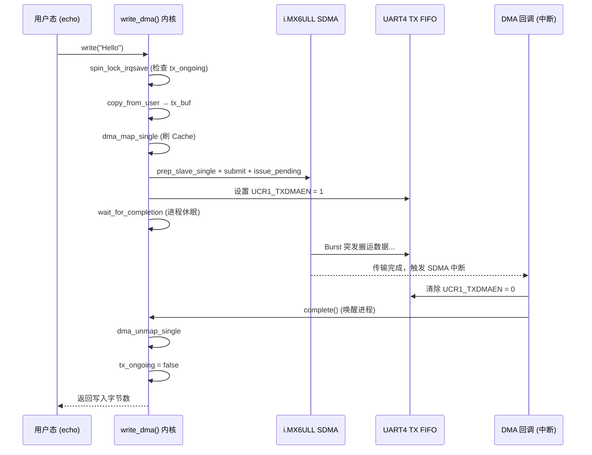
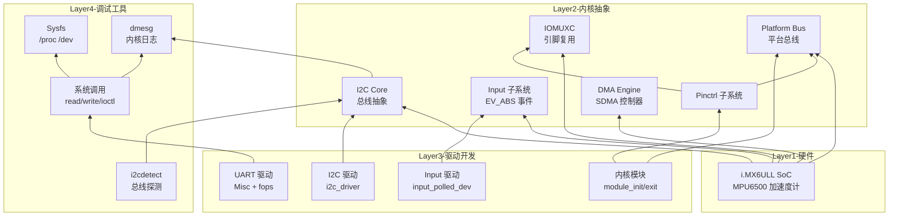

# Bootlin Linux Kernel & Driver Development Course — 实验总结

> 硬件平台：NXP i.MX6ULL (100ask Pro) | 交叉编译：WSL2 + arm-linux-gnueabihf-gcc
> 内核版本：Linux 4.9.88
> 课程来源：Bootlin "Linux kernel and driver development course"

---

## 一、课程全景知识图谱

```mermaid
mindmap
  root((Bootlin 驱动课程))
    01-Writing Modules
      内核模块编写基础
      module_init/module_exit
      module_param/sysfs
      ktime_get_seconds/时间统计
      utsname()->release/运行时版本
    02-Describing Hardware
      设备树 &label 覆盖语法
      /delete-property/ 删除继承属性
      GPIO LED 节点覆盖
      I2C 子设备声明 mpu6500@68
      interrupt-parent/interrupts 属性
    03-Pin Multiplexing
      IOMUXC 引脚复用控制器
      pinctrl 两级节点结构
      pad 配置 0x4001b8b1
      /delete-property/ 解决 pinctrl-0 冲突
      status = "disabled" 释放引脚
    04-Using the I2C Bus
      i2c_driver 驱动模型
      i2c_transfer 两消息 burst read
      WHO_AM_I 寄存器验证
      Big-Endian 数据组装
      i2c_smbus_read/write_byte_data
    05-Input Interface
      input_polled_dev 框架
      EV_ABS 绝对坐标事件
      input_report_abs/input_sync
      Bridge: I2C 物理层 → input 逻辑层
      poll_interval = 50ms
    06-Accessing IO Memory
      ioremap/devm_ioremap_resource
      readl/writel 读写接口
      clk_get_rate/clk_prepare_enable
      波特率公式 UBIR/UBMR
      cpu_relax + 超时保护轮询 TX
    07-Output Misc Driver
      misc_register 动态申请设备号
      file_operations write/ioctl
      container_of 反向追溯结构体
      copy_from_user/put_user 数据交换
      \\n → \\r\\n 换行符转义
      devm_kasprintf 动态设备名
    08-Sleeping Interrupts
      devm_request_irq 注册中断
      ISR + Ring Buffer 生产者/消费者
      wait_event_interruptible 阻塞休眠
      wake_up_interruptible ISR 唤醒
      UCR3_RXDMUXSEL NXP 硬件quirk
    09-Locking
      spin_lock_irqsave 进程上下文
      spin_lock ISR 上下文
      持锁期间禁止休眠
      三明治原则：锁外分配/拷贝
    10-DMA
      dma_request_chan 申请 SDMA 通道
      dmaengine_slave_config 传输配置
      dma_map_resource TX FIFO 物理地址
      dma_map_single 流式映射刷 Cache
      init_completion/wait_for_completion
      EPROBE_DEFER 延迟 DMA 探测
      PIO Fallback DMA 失败时降级
```

---

## 二、实验分章详解

### 01 Writing Modules — 内核模块编写

**核心目标：** 编写第一个内核模块，掌握模块化编程基础和 Out-of-tree 编译方式。

**关键知识点：**

1. **`module_init` / `module_exit`**：声明模块的入口和退出函数，内核在加载/卸载时自动调用。
2. **`module_param`**：通过 `sysfs` 导出可运行时修改的参数，`/sys/module/<name>/parameters/` 下可见。
3. **`ktime_get_seconds()`** + **`time64_t`**：获取模块加载时间，`time64_t` 防止 32 位 Y2038 问题。
4. **`utsname()->release`**：运行时获取内核版本，**必须用运行时 API**，不能用 `LINUX_VERSION_CODE` 宏。

**Out-of-tree 编译 Makefile 核心逻辑：**


**验证命令：**
```bash
file hello_version.ko    # 确认为 ARM ELF 文件
insmod hello_version.ko  # 上板加载
dmesg | tail             # 查看输出
```

---

### 02 Describing Hardware Devices — 设备树描述硬件

**核心目标：** 掌握 Device Tree 节点覆盖语法，声明 GPIO LED 和 I2C 设备节点。

**关键知识点：**

- `&label` 语法：引用已有节点并覆盖属性，合并到原节点上。
- `/delete-property/`：强制删除被合并后遗留的父节点属性。
- `interrupt-parent` / `interrupts`：指定 GPIO 中断控制器和触发方式。
- `compatible` 字符串：驱动匹配的"钥匙"，设备树和驱动必须一致。

**设备树关键修改：**

```dts
/* 启用 LED 设备树节点 */
&{/leds} {
    status = "okay";
};

&led0 {
    linux,default-trigger = "heartbeat";
    default-state = "on";
};

/* 在 I2C1 总线上声明 MPU6500 */
&i2c1 {
    mpu6500@68 {
        compatible = "invensense,mpu6500";
        reg = <0x68>;
        interrupt-parent = <&gpio2>;
        interrupts = <0 IRQ_TYPE_EDGE_RISING>;
    };
};
```

---

### 03 Configuring Pin Multiplexing — 引脚复用

**核心目标：** 通过 pinctrl 子系统将 I2C1 复用至 CSI 摄像头引脚，掌握 NXP 两级节点结构和 pad 配置值。

**NXP pinctrl 两级节点结构（驱动强制要求）：**

```dts
&iomuxc {
    my_board_grp {                    /* 容器节点（必须有）*/
        pinctrl_my_i2c1: my_i2c1grp {
            fsl,pins = <
                MX6UL_PAD_CSI_PIXCLK__I2C1_SCL 0x4001b8b1
                MX6UL_PAD_CSI_MCLK__I2C1_SDA   0x4001b8b1
            >;
        };
    };
};
```

**Pad 配置 0x4001b8b1 详解：**

| 位域 | 值 | 含义 |
|------|-----|------|
| bit 30 | 0x40000000 | SION — 强制 I2C 控制器回读总线（仲裁/ACK 检测） |
| bit 11 | 0x0800 | ODE — 开漏使能（I2C 线与逻辑必须）|
| bit 13 | 0x2000 | PKE — Pull/Keeper 使能 |
| bit 14 | 0x4000 | PUE — 选择上拉而非 Keeper |
| bit 15 | 0x8000 | HYS — 迟滞输入 |

**SION 位的重要性：** I2C 控制器发送数据时需要回读总线电平来检测仲裁丢失和 ACK 位。若未置 SION，控制器变成"瞎子"，会报 Timeout 或 Arbitration lost。

**踩过的坑：**

| 错误 | 正确 | 原因 |
|------|------|------|
| `reg = <68>` | `reg = <0x68>` | DTS 默认十六进制，68 → 0x44（地址完全错误）|
| `pinctrl_xxx` 直接放 `&iomuxc` 下 | 必须包一层容器节点 | NXP pinctrl 驱动要求双层结构，否则 `-EINVAL` |
| 只写 `pinctrl-0 = <&pinctrl_my_i2c1>` | 加 `/delete-property/` | 原厂 `.dts` 中已有 `pinctrl-0`，合并后冲突 |

---

### 04 Using the I2C Bus — I2C 总线驱动

**核心目标：** 编写 `i2c_driver`，实现对 MPU6500 加速度计的 I2C 访问。

**I2C Burst Read 两消息协议：**



**WHO_AM_I 验证：**
```c
who_am_i = i2c_smbus_read_byte_data(client, MPU6500_REG_WHO_AM_I);
if (who_am_i != MPU6500_WHOAMI_VALUE)  /* 期望 0x70 */
    return -ENODEV;
```

**Probe/Remove 生命周期：**
```c
static int mpu6500_probe(struct i2c_client *client, ...) {
    i2c_smbus_write_byte_data(client, MPU6500_REG_PWR_MGMT_1, MPU6500_WAKEUP_VALUE);
    return 0;
}
static int mpu6500_remove(struct i2c_client *client) {
    i2c_smbus_write_byte_data(client, MPU6500_REG_PWR_MGMT_1, MPU6500_SLEEP_VALUE);
    return 0;
}
```

---

### 05 Input Interface — 输入子系统桥接

**核心目标：** 将 MPU6500 桥接到 Linux input 子系统，使 `evtest` 可直接读取加速度数据。

**分层架构：**



**关键 API：**

```c
poll_dev->poll = mpu6500_poll;          // 定时回调（50ms 间隔）
poll_dev->poll_interval = 50;
set_bit(EV_ABS, input->evbit);            // 必须设 EV_ABS 才能用 evtest
input_set_abs_params(input, ABS_X, -32768, 32767, 8, 0);

input_report_abs(input, ABS_X, ax);        // 上报事件
input_sync(input);                        // 必须同步！
```

---

### 06 Accessing I/O Memory and Ports — 内存映射 I/O 与 UART

**核心目标：** 通过 `ioremap` 映射 UART 寄存器，配置时钟和波特率，实现轮询发送。

**Probe 初始化序列（按顺序）：**



**波特率配置（115200 @ per_rate）：**
```
UFCR[9:7] = 101b    → div-by-1（不分频）
UBIR = 15            → 与公式中 16 抵消，简化计算
UBMR = (per_rate / 115200) - 1
```

**TX 超时保护：**
```c
while (!(readl(dev->regs + USR2) & USR2_TXFE) && (timeout > 0))
    cpu_relax(), timeout--;
```

---

### 07 Output-only Misc Driver — 输出型杂项驱动

**核心目标：** 注册 Misc 字符设备，提供 `write` 和 `ioctl` 接口，实现用户空间与内核的双向通信。

**container_of 反向追溯：**



**`\n` → `\r\n` 转义（串口终端兼容性）：**
```c
for (i = 0; i < count; i++) {
    char c = kbuf[i];
    if (c == '\n')
        my_uart_putc(dev, '\r');  // 补回车符
    my_uart_putc(dev, c);
}
```

**IOCTL 命令定义：**
```c
#define SERIAL_RESET_COUNTER _IO('s', 0)
#define SERIAL_GET_COUNTER   _IOR('s', 1, int)
```

---

### 08 Sleeping and Handling Interrupts — 中断注册与进程休眠

**核心目标：** 实现从"轮询"到"事件驱动"的跨越，通过 ISR + Ring Buffer + Wait Queue 完成中断驱动的数据接收。

**中断 + 等待队列协作模型：**



**UCR3_RXDMUXSEL（i.MX6ULL 硬件quirk）：**

i.MX6ULL 的 UART RX 引脚默认连接到 SoC 内部，必须置 `UCR3_RXDMUXSEL (bit 2)` 才能将外部引脚路由到 RX 逻辑，否则始终收到 0。

**Ring Buffer 生产者/消费者：**

```c
/* ISR（生产者）*/
rx_buf[buf_wr] = c;
buf_wr = (buf_wr + 1) % SERIAL_BUFSIZE;

/* read()（消费者）*/
c = rx_buf[buf_rd];
buf_rd = (buf_rd + 1) % SERIAL_BUFSIZE;
```

---

### 09 Locking — 并发保护

**核心目标：** 掌握自旋锁在中断上下文和进程上下文中的使用规则，防止竞态条件。

**Spinlock vs Mutex：**

| 维度 | Spinlock | Mutex |
|------|----------|-------|
| 持有锁时休眠 | **不允许** | 允许 |
| 适用场景 | **中断上下文** | 进程上下文 |
| 获取失败行为 | 自旋（忙等） | 睡眠（调度） |
| 中断安全 | ✅ 配合 irqsave | ❌ |

**正确加锁模式（实验08的真实代码）：**

```c
/* ISR 中：使用 spin_lock（中断上下文本身已禁止抢占）*/
static irqreturn_t my_uart_isr(int irq, void *dev_id) {
    unsigned long flags;
    spin_lock_irqsave(&dev->lock, flags);   // ⚠️ ISR 中也用 irqsave
    rx_buf[buf_wr] = c;                      // 访问共享 buffer
    spin_unlock_irqrestore(&dev->lock, flags);
    wake_up_interruptible(&dev->wait);
    return IRQ_HANDLED;
}

/* read() 中：使用 spin_lock_irqsave（禁止本地 CPU 中断，防止死锁）*/
ssize_t my_uart_read(struct file *file, ...) {
    unsigned long flags;
    spin_lock_irqsave(&dev->lock, flags);
    c = rx_buf[buf_rd];                       // 从 buffer 取到局部变量
    spin_unlock_irqrestore(&dev->lock, flags);
    put_user(c, buf);                        // ⚠️ copy 必须在锁外！
    return 1;
}
```

**三明治原则：** 持锁前完成所有 `copy_from_user` / `kmalloc(GFP_KERNEL)`，持锁期间只做最小化共享数据访问。

---

### 10 DMA — SDMA 引擎与异步传输

**核心目标：** 将 UART TX 从 CPU 逐字节轮询升级为 SDMA 控制器自动搬运，实现零拷贝、高效率传输。

**为什么需要 DMA？**

| 模式 | CPU 角色 | 效率 | 适用场景 |
|------|----------|------|----------|
| PIO | 逐字节轮询等待 | 低（CPU 空转） | 小数据、低频率 |
| DMA | 配置后即可并行 | 高（CPU 可做其他事）| 大数据、高频率 |

**Linux DMA 两套 API：**



**Cache 一致性（最核心难点）：**

```
copy_from_user() 数据 → 写入 CPU L1/L2 Cache（未到 DDR）
     ↓
SDMA 控制器从 DDR 读数据 → 读到垃圾数据 → 串口发出乱码
```

**破局：dma_map_single 执行 Cache Clean**

```c
dma_addr = dma_map_single(dev->dev, tx_buf, len, DMA_TO_DEVICE);
// 底层：强制将 CPU Cache 中的数据刷入 DDR
// 返回值：SDMA 认得的"总线物理地址"
```

**映射铁律：**
1. `dma_map_single` 后、`dma_unmap_single` 前，**禁止 CPU 读写 tx_buf**
2. 发送用 `DMA_TO_DEVICE`（Clean），接收用 `DMA_FROM_DEVICE`（Invalidate）
3. 必须成对出现，有 Map 必有 Unmap

**完整 DMA Write 执行流（实验10真实代码）：**



**NXP 关键位（已验证手册）：**

```c
#define UCR1_TXDMAEN (1 << 3)   // i.MX6ULL: bit 3（设置后自动触发 DMA）
```

**TXTL 水位线与 dst_maxburst 关系：**

| TXTL 值 | FIFO 空位 | 触发时机 | dst_maxburst 安全上限 |
|---------|-----------|----------|---------------------|
| 2 | 30 | 快空时才要货 | ≤ 30 |
| **16** | **16** | **空一半时报饿** | **≤ 16（推荐）**|
| 31 | 1 | 有位就立刻要 | 只能 1 |

`TXTL = 16` + `dst_maxburst = 16` 是 i.MX6ULL UART 的最优配置。

**PIO Fallback 回退机制：**

```c
ret = my_uart_init_dma(pdev, my_dev);
if (ret == 0) {
    my_dev->miscdev.fops = &my_uart_fops_dma;  // DMA 模式
} else {
    my_dev->miscdev.fops = &my_uart_fops;       // 回退轮询模式
}
```

即使 DMA 初始化失败（如设备树未配置 `dmas` 属性），设备依然可用，保证鲁棒性。

---

## 三、知识关联总图



---

## 四、i2cdetect 结果解读

| 输出 | 含义 |
|------|------|
| `UU` | 设备被内核驱动占用 — **驱动与设备匹配成功** |
| `68` | 硬件存在但无驱动匹配 |
| `--` | 总线通但无设备响应 |
| `xx` | 设备响应但无对应驱动（孤儿设备）|

**排查三层法：**
1. **软件层**：compatible 匹配 / pinctrl 配置 — `dmesg | grep i2c`
2. **物理层**：接线 / 电源 / 电平 — 万用表
3. **协议层**：地址 / 时序 — 示波器 / 逻辑分析仪

---

## 五、核心知识点速查

### 5.1 模块与内核
- `__init` 标记的函数初始化完成后**内存被释放**
- `utsname()->release` 是**运行时** API，`LINUX_VERSION_CODE` 是编译时宏
- `insmod` vs `modprobe`：**modprobe** 自动解析 `modules.dep`

### 5.2 设备树
- `compatible` 是驱动匹配的"钥匙"，驱动和 DTS 必须一致
- `/delete-property/` 必须在**覆盖属性之前**使用
- `reg = <0x68>` 必须加 `0x` 前缀（DTS 默认十六进制）

### 5.3 中断与锁
- 中断上下文**不能休眠**，只能用 `spin_lock`
- 进程上下文用 `spin_lock_irqsave`（保存/恢复中断状态）
- `copy_to_user` / `kmalloc(GFP_KERNEL)` **不能在持锁期间调用**

### 5.4 I2C 与 Pin Muxing
- I2C 必须是**开漏 + 上拉**：`ODE=1` 实现线与逻辑
- NXP pinctrl 驱动要求**双层目录结构**
- SION 位让 I2C 控制器能回读总线状态（仲裁/ACK 检测）

### 5.5 Input 子系统
- `input_sync()` 标记一批事件上报完成，**必须调用**
- `input_set_abs_params` 设置值范围后 evtest 才能读取

### 5.6 DMA 与 Cache 一致性
- `dma_map_single` 对发送执行 **Cache Clean**（刷入 DDR）
- `dma_unmap_single` 对接收执行 **Cache Invalidate**（CPU 重新读 DDR）
- 流式映射期间，**CPU 禁止读写缓冲区**（会导致 Cache 污染）
- `IS_ERR()` 不是 `== NULL`：错误指针用 `PTR_ERR` 提取错误码
- `UCR1_TXDMAEN = (1 << 3)` 是 i.MX6ULL UART DMA 触发位

---

## 六、踩坑经验汇总

| # | 场景 | 错误表现 | 根因 | 解决方案 |
|---|------|----------|------|----------|
| 1 | `reg = <68>` | 驱动找不到设备 | DTS 默认十六进制，68 → 0x44 | 改为 `reg = <0x68>` |
| 2 | `MX6ULL_PAD_...` | 编译 FATAL ERROR | 头文件用 `MX6UL_PAD_...` | 使用 `MX6UL_PAD_...` |
| 3 | pinctrl 直接放 `&iomuxc` 下 | `no groups defined` | NXP 驱动要求双层嵌套 | 包一层容器节点 |
| 4 | 只写 `pinctrl-0 = <&...>` | 属性冲突 | 原厂 `.dts` 已有 `pinctrl-0` | 加 `/delete-property/` |
| 5 | 持 spinlock 调 `copy_to_user` | `BUG: sleeping in atomic` | 持锁进入原子上下文，不能休眠 | 将 copy 移到锁外 |
| 6 | DTB 文件名不匹配 U-Boot | 设备树不生效 | 编译名 ≠ U-Boot 加载名 | `cat /sys/firmware/devicetree/base/model` 验证 |
| 7 | DMA 申请失败未重置 `tx_ongoing` | 所有 write 调用永久 `-EBUSY` | 错误路径未清标志位 | `goto err_out` 中必须重置 |
| 8 | DMA 回调忘关 TXDMAEN | SDMA 报 Request Error | 传输结束但 UART 仍向 SDMA 发无效请求 | 回调中必须 `&= ~UCR1_TXDMAEN` |
| 9 | 未设 `UCR3_RXDMUXSEL` | RX 始终收到 0 | i.MX6ULL 必须显式路由外部引脚 | 初始化时 `reg |= UCR3_RXDMUXSEL` |

---

*文档生成时间：2026-04-09 | 基于 Bootlin Linux Kernel and Driver Development Course 实验记录*
