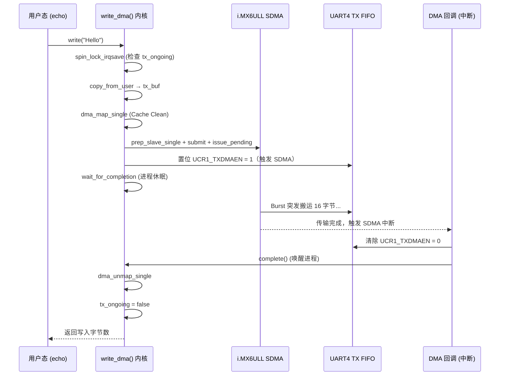
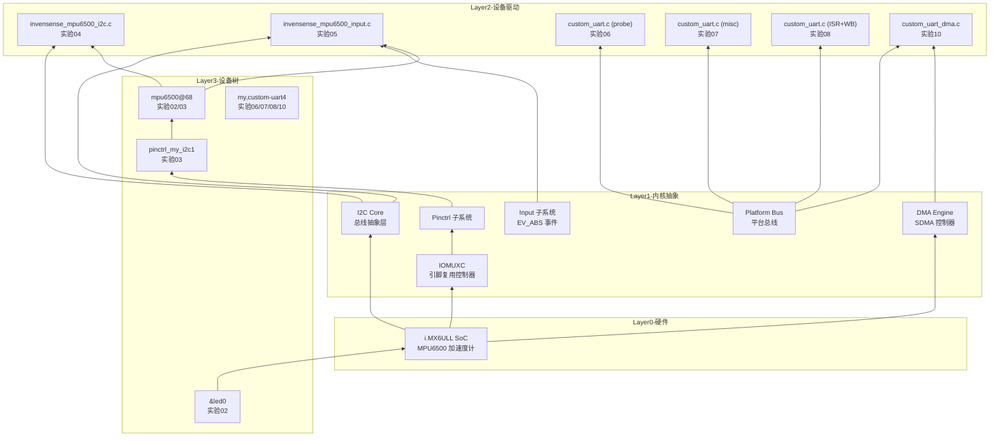

# Bootlin Linux Kernel & Driver Development Course — 实验总结

> 硬件平台：NXP i.MX6ULL (100ask Pro) | 交叉编译：WSL2 + arm-linux-gnueabihf-gcc
> 内核版本：Linux 4.9.88
> 课程来源：Bootlin "Linux kernel and driver development course"
> **所有代码均为本人实际编写，基于 MPU6500 加速度计 + UART4 真实硬件**

---

## 一、课程全景知识图谱

```mermaid
mindmap
  root((Bootlin 驱动课程))
    01-Writing Modules
      hello_version.c 模块
      module_param sysfs 参数
      ktime_get_seconds 运行时统计
      utsname()->release 内核版本
    02-Describing Hardware
      &{/leds} 节点覆盖
      &led0 心跳灯配置
      &i2c1 mpu6500@68 声明
      interrupt-parent GPIO 中断
    03-Pin Multiplexing
      pinctrl 两级节点结构
      0x4001b8b1 开漏 pad 配置
      CSI I2C1 SCL/SDA 复用
      /delete-property/ 删除继承
    04-Using I2C Bus
      i2c_driver 驱动模型
      i2c_transfer burst read
      WHO_AM_I 身份验证
      Big-Endian 数据组装
    05-Input Interface
      input_polled_dev 框架
      EV_ABS 绝对坐标事件
      input_report_abs/sync
      Bridge: I2C → input 子系统
    06-Accessing IO Memory
      devm_ioremap_resource
      clk_get_rate 波特率公式
      readl/writel MMIO
      cpu_relax 超时保护
    07-Output Misc Driver
      misc_register 动态设备号
      container_of 反向追溯
      \\n → \\r\\n 换行转义
      copy_from_user 数据交换
    08-Sleeping Interrupts
      devm_request_irq ISR
      ISR + Ring Buffer 模型
      wait_event_interruptible
      UCR3_RXDMUXSEL 硬件 quirk
    09-Locking
      spin_lock_irqsave 进程上下文
      spin_lock ISR 上下文
      持锁禁止休眠规则
      三明治原则
    10-DMA
      dma_request_chan SDMA 通道
      dma_map_resource FIFO 地址
      dma_map_single Cache 同步
      tx_ongoing 防竞争标志
      EPROBE_DEFER PIO 回退
```

---

## 二、实验分章详解

### 01 Writing Modules — 内核模块编写

**核心目标：** 编写第一个内核模块，掌握 Out-of-tree 编译方式、模块参数和运行时内核版本检测。

**关键知识点：**

1. **`module_init` / `module_exit`**：声明模块入口和退出函数，内核在加载/卸载时自动调用。
2. **`module_param(whom, charp, 0644)`**：通过 `sysfs` 导出可运行时修改的参数，写入 `/sys/module/hello_version/parameters/whom` 即时生效。
3. **`ktime_get_seconds()`** + **`time64_t`**：获取模块加载时间，`time64_t` 防止 32 位 Y2038 问题。
4. **`utsname()->release`**：运行时获取内核版本字符串，**必须用运行时 API**，不能用编译期宏。

**实际代码（`hello_version.c`）：**

```c
#include <linux/init.h>
#include <linux/module.h>
#include <linux/utsname.h>
#include <linux/moduleparam.h>
#include <linux/ktime.h>

MODULE_LICENSE("GPL");

static char *whom = "world";
static int howmany = 1;
static time64_t load_time;  /* Y2038 安全 */

module_param(whom, charp, 0644);
module_param(howmany, int, 0644);

static int __init hello_version_init(void)
{
    load_time = ktime_get_seconds();
    pr_info("Hello Module! Kernel: %s\n", utsname()->release);
    /* ... 循环打印 ... */
    return 0;
}

static void __exit hello_version_exit(void)
{
    pr_info("Goodbye! Module lived %lld seconds.\n",
            (long long)(ktime_get_seconds() - load_time));
}

module_init(hello_version_init);
module_exit(hello_version_exit);
```

**Out-of-tree 双遍 Makefile：**

```makefile
# 第一遍：KERNELRELEASE 未定义，执行外层
ifneq ($(KERNELRELEASE),)
    obj-m := hello_version.o        # Kbuild 识别并编译
else
    KDIR := $(HOME)/100ask_imx6ull-sdk/Linux-4.9.88
    all:
        $(MAKE) -C $(KDIR) M=$(shell pwd) modules
endif
```

**验证：**
```bash
file hello_version.ko     # 确认为 ARM ELF: ELF 32-bit LSB
insmod hello_version.ko   # 加载
dmesg | tail              # 查看 "Hello Module! Kernel: 4.9.88"
```

---

### 02 Describing Hardware Devices — 设备树描述硬件

**核心目标：** 通过修改设备树，在现有硬件描述中声明 MPU6500 加速度计和配置用户 LED，验证 Device Tree `&label` 覆盖语法。

**关键知识点：**

1. **`&{/leds}` / `&led0`**：`&` 引用已有节点，`{/leds}` 通过路径访问根下直接节点。
2. **`&i2c1`**：在 I2C1 总线节点下插入 MPU6500 子节点。
3. **`interrupt-parent = <&gpio2>`**：指定 GPIO2 为中断控制器。
4. **`interrupts = <0 IRQ_TYPE_EDGE_RISING>`**：GPIO2 第 0 号引脚，上升沿触发。
5. **`reg = <0x68>`**：I2C 从机地址（0x68 = 十进制 104，AD0 接地）。

**实际设备树（`imx6ull-100ask-custom.dts`）：**

```dts
/dts-v1/;
#include <dt-bindings/interrupt-controller/irq.h>
#include "100ask_imx6ull-14x14.dts"

/ {
    model = "Training i.MX6ULL by Han";
};

/* 启用 LED 设备树节点 */
&{/leds} {
    status = "okay";
};

&led0 {
    linux,default-trigger = "heartbeat";  /* 心跳灯 */
    default-state = "on";
};

/* 在 I2C1 总线上声明 MPU6500 */
&i2c1 {
    mpu6500@68 {
        compatible = "invensense,mpu6500";  /* 匹配内核内置驱动 */
        reg = <0x68>;

        /* GPIO2 PIN0 作为中断（驱动需要，即使轮询也要求） */
        interrupt-parent = <&gpio2>;
        interrupts = <0 IRQ_TYPE_EDGE_RISING>;
    };
};
```

**验证：**
```bash
make dtbs  # 从 Linux 内核源码目录执行
adb push arch/arm/boot/dts/imx6ull-100ask-custom.dtb /boot/
adb shell reboot
adb shell dmesg | grep -i mpu  # inv-mpu6050 驱动加载
adb shell i2cdetect -y 1        # 0x68 显示 "UU"（驱动已占用）
```

---

### 03 Configuring Pin Multiplexing — 引脚复用配置

**核心目标：** 通过 pinctrl 子系统将 I2C1 复用至 CSI 摄像头引脚（非默认引脚），解决引脚冲突，验证 NXP 两级 pinctrl 节点结构。

**关键知识点：**

1. **NXP pinctrl 两级节点结构**：`container_node → pin_group`，无容器节点则 NXP pinctrl 驱动返回 `-EINVAL`。
2. **`0x4001b8b1` pad 配置**：SION(1) + ODE(1) + PKE(1) + PUE(1) + HYS(1) → 开漏 + 内部上拉，I2C 安全配置。
3. **`/delete-property/`**：删除从父节点继承的 `pinctrl-0`，避免与新配置冲突。
4. **`status = "disabled"`**：禁用 UART6（与 CSI 引脚冲突）。
5. **开漏原理**：I2C 总线可被任意设备拉低，开漏 + 上拉电阻实现线与（wire-AND）逻辑。

**实际设备树（`imx6ull-100ask-custom.dts`）：**

```dts
&iomuxc {
    /* NXP 两级结构：容器节点 + 引脚组 */
    my_board_grp {
        pinctrl_my_i2c1: my_i2c1grp {
            fsl,pins = <
                /* CSI_PIXCLK → I2C1_SCL，pad=0x4001b8b1 */
                MX6UL_PAD_CSI_PIXCLK__I2C1_SCL   0x4001b8b1
                /* CSI_MCLK → I2C1_SDA */
                MX6UL_PAD_CSI_MCLK__I2C1_SDA     0x4001b8b1
            >;
        };
    };
};

/* 释放 CSI 引脚（UART6 占用） */
&uart6 {
    status = "disabled";
};

&i2c1 {
    /* 先删除继承属性，再添加新配置 */
    /delete-property/ pinctrl-names;
    /delete-property/ pinctrl-0;

    pinctrl-names = "default";
    pinctrl-0 = <&pinctrl_my_i2c1>;  /* 应用 CSI 引脚组 */
    clock-frequency = <100000>;        /* 100kHz 标准 I2C */
    status = "okay";

    mpu6500@68 {
        compatible = "invensense,mpu6500";
        reg = <0x68>;
        interrupt-parent = <&gpio2>;
        interrupts = <0 2>;
    };
};
```

**`0x4001b8b1` 位域详解：**

| 位段 | 值 | 含义 |
|------|----|------|
| bit 31 (SION) | 1 | Software Input On，强制该引脚作为输入（调试用） |
| bit 14 (ODE) | 1 | Open Drain Enable，**I2C 必须** |
| bit 12 (PKE) | 1 | Pull / Keeper Enable |
| bit 11 (PUE) | 1 | Pull Selected（而非 Keeper） |
| bit 8 (HYS) | 1 | Hysteresis Enable |

---

### 04 Using the I2C Bus — I2C 总线驱动

**核心目标：** 编写 i2c_driver 驱动，通过两消息 burst read 协议读取 MPU6500 加速度计原始数据，并用 WHO_AM_I 寄存器验证硬件身份。

**关键知识点：**

1. **`i2c_driver` 框架**：`probe`/`remove` + `id_table`，匹配设备后内核自动调用 probe。
2. **两消息 burst read**：`i2c_msg[0]` 写寄存器地址，`i2c_msg[1]` 读数据，`i2c_transfer` 一次完成。
3. **`i2c_smbus_read_byte_data`**：单字节读写，内部自动处理 SMBus 协议。
4. **WHO_AM_I 验证**：`MPU6500_REG_WHO_AM_I = 0x75`，预期值 `0x70`，不匹配则返回 `-ENODEV`。
5. **Big-Endian 数据组装**：MPU6500 高字节在前，`ax = (data[0] << 8) | data[1]`。

**实际代码（`invensense_mpu6500_i2c.c`）：**

```c
#include <linux/i2c.h>

#define MPU6500_REG_WHO_AM_I    0x75
#define MPU6500_REG_PWR_MGMT_1  0x6B
#define MPU6500_ACCEL_XOUT_H    0x3B
#define MPU6500_WHOAMI_VALUE    0x70

/* burst read：写寄存器地址，再读 6 字节（X/Y/Z） */
static int mpu6500_read_accel(struct i2c_client *client, short *x, short *y, short *z)
{
    u8 reg_addr = MPU6500_ACCEL_XOUT_H;
    u8 data[6];
    struct i2c_msg msgs[2] = {
        [0] = { .addr = client->addr, .flags = 0,         .len = 1, .buf = &reg_addr },
        [1] = { .addr = client->addr, .flags = I2C_M_RD, .len = 6, .buf = data },
    };

    if (i2c_transfer(client->adapter, msgs, 2) != 2)
        return -EIO;

    /* MPU6500 为 Big-Endian：高字节在前 */
    *x = (data[0] << 8) | data[1];
    *y = (data[2] << 8) | data[3];
    *z = (data[4] << 8) | data[5];
    return 0;
}

static int mpu6500_probe(struct i2c_client *client, const struct i2c_device_id *id)
{
    int who_am_i = i2c_smbus_read_byte_data(client, MPU6500_REG_WHO_AM_I);
    if (who_am_i != MPU6500_WHOAMI_VALUE) {
        dev_err(&client->dev, "WHO_AM_I mismatch: got 0x%02x\n", who_am_i);
        return -ENODEV;
    }

    i2c_smbus_write_byte_data(client, MPU6500_REG_PWR_MGMT_1, 0x00);  /* 唤醒 */
    /* 读取并打印加速度数据 ... */
    return 0;
}

static const struct of_device_id mpu6500_of_match[] = {
    { .compatible = "my,custom-mpu6500", },
    { }
};

static struct i2c_driver mpu6500_driver = {
    .driver = { .name = "invensense_mpu6500", .of_match_table = mpu6500_of_match },
    .probe    = mpu6500_probe,
    .remove   = mpu6500_remove,
    .id_table = mpu6500_id,
};

module_i2c_driver(mpu6500_driver);
```

---

### 05 Input Interface — 输入子系统桥接

**核心目标：** 使用 `input_polled_dev` 框架，将 MPU6500 I2C 物理层桥接至 Linux input 逻辑层，使 `evtest` 工具可直接读取加速度数据。

**关键知识点：**

1. **`input_polled_dev`**：轮询型输入设备框架，内核工作队列定期调用 `poll` 回调读取硬件。
2. **`EV_ABS`**：绝对坐标事件类型（相对 `EV_REL` 相对坐标）。
3. **`input_report_abs` / `input_sync`**：每报告完一族 abs 事件后必须调用 `input_sync`。
4. **`devm_kzalloc` / `devm_input_allocate_polled_device`**：`devm_*` 系列函数在设备 remove 时自动释放资源。
5. **`input_set_abs_params(input, ABS_X, -32768, 32767, 8, 0)`**：设置 abs 轴的 min/max/flat/fuzz 值，驱动内核 abs 事件规范化。
6. **`poll_interval = 50`**：50ms 间隔，即 20Hz 采样率。

**实际代码（`invensense_mpu6500_input.c`）：**

```c
#include <linux/input-polldev.h>

struct mpu6500_dev {
    struct i2c_client *client;
    struct input_polled_dev *poll_dev;
};

/* 内核工作队列定期调用此回调 */
static void mpu6500_poll(struct input_polled_dev *poll_dev)
{
    struct mpu6500_dev *mpu = poll_dev->private;
    short ax, ay, az;

    if (mpu6500_read_accel(mpu->client, &ax, &ay, &az) != 0)
        return;

    /* 向 input 子系统报告 EV_ABS 绝对坐标事件 */
    input_report_abs(poll_dev->input, ABS_X, ax);
    input_report_abs(poll_dev->input, ABS_Y, ay);
    input_report_abs(poll_dev->input, ABS_Z, az);
    input_sync(poll_dev->input);  /* 必须调用，标志一帧结束 */
}

static int mpu6500_probe(struct i2c_client *client, const struct i2c_device_id *id)
{
    struct mpu6500_dev *mpu = devm_kzalloc(&client->dev, sizeof(*mpu), GFP_KERNEL);
    struct input_polled_dev *poll_dev = devm_input_allocate_polled_device(&client->dev);

    poll_dev->private = mpu;
    poll_dev->poll        = mpu6500_poll;
    poll_dev->poll_interval = 50;  /* 20Hz */

    set_bit(EV_ABS, poll_dev->input->evbit);
    input_set_abs_params(poll_dev->input, ABS_X, -32768, 32767, 8, 0);
    input_set_abs_params(poll_dev->input, ABS_Y, -32768, 32767, 8, 0);
    input_set_abs_params(poll_dev->input, ABS_Z, -32768, 32767, 8, 0);

    input_register_polled_device(poll_dev);
    return 0;
}
```

**验证：**
```bash
adb shell evtest /dev/input/event0
# 输出：ABS_X ABS_Y ABS_Z 三轴加速度 raw 值
```

---

### 06 Accessing I/O Memory and Ports — 内存映射 I/O 与 UART

**核心目标：** 编写平台设备驱动，通过 `devm_ioremap_resource` 将 UART 物理寄存器映射为虚拟地址，初始化时钟框架，配置波特率并验证 TX 功能。

**关键知识点：**

1. **`devm_ioremap_resource`**：同时完成 `request_mem_region` + `ioremap`，失败返回错误码，无需手动 unmap。
2. **时钟框架**：`clk_prepare_enable` 启用时钟（可失败需检查返回值），`clk_get_rate` 获取时钟频率（计算波特率用）。
3. **波特率公式**：`UBIR = 15`，`UBMR = per_clk / 115200 - 1`，由 UART 参考手册规定。
4. **`cpu_relax()` + 超时计数**：TX FIFO 轮询时用 `cpu_relax()` 提示编译器优化寄存器访问，同时设置上限防止硬件故障时内核永久挂起。
5. **UART 关键寄存器**：`UCR1_UARTEN`、`UCR2_SRST`(软复位)、`UCR2_TXEN`、`USR2_TXFE`(TX FIFO 空标志)。

**实际代码（`06-Accessing-IO-Memory-and-Ports/custom_uart.c`）：**

```c
/* i.MX6ULL UART 寄存器偏移 */
#define UTXD  0x40
#define UCR1  0x80
#define UCR2  0x84
#define UFCR  0x90
#define USR2  0x98
#define UBIR  0xA4
#define UBMR  0xA8

static int my_uart_probe(struct platform_device *pdev)
{
    struct my_uart_dev *my_dev = devm_kzalloc(&pdev->dev, sizeof(*my_dev), GFP_KERNEL);
    struct resource *res = platform_get_resource(pdev, IORESOURCE_MEM, 0);
    my_dev->regs = devm_ioremap_resource(&pdev->dev, res);  /* 物理→虚拟地址 */

    /* 获取并启用 IPG 和 PER 时钟 */
    my_dev->clk_ipg = devm_clk_get(&pdev->dev, "ipg");
    my_dev->clk_per = devm_clk_get(&pdev->dev, "per");
    clk_prepare_enable(my_dev->clk_ipg);
    clk_prepare_enable(my_dev->clk_per);

    /* 硬件初始化：UART 使能 + 软复位 */
    writel(UCR1_UARTEN, my_dev->regs + UCR1);
    writel(UCR2_SRST | UCR2_TXEN | UCR2_WS | UCR2_IRTS, my_dev->regs + UCR2);

    /* 波特率 115200 */
    unsigned long per_rate = clk_get_rate(my_dev->clk_per);
    writel((5 << 7), my_dev->regs + UFCR);       /* div = 1 */
    writel(15, my_dev->regs + UBIR);
    writel((per_rate / 115200) - 1, my_dev->regs + UBMR);

    /* 发送 100 个字符验证硬件，含超时保护 */
    for (i = 0; i < 100; i++) {
        timeout = 1000000;
        while (!(readl(my_dev->regs + USR2) & USR2_TXFE) && --timeout)
            cpu_relax();   /* 提示编译器这是忙等，可优化寄存器读取 */
        writel('H' + (i % 26), my_dev->regs + UTXD);
        msleep(100);
    }
    return 0;
}
```

---

### 07 Output-only Misc Driver — 输出型杂项驱动

**核心目标：** 在实验 06 基础上增加 Misc 设备注册（`/dev/serial-21f0000`）、文件操作（`write`/`ioctl`）和 `container_of` 反向追溯，实现用户态可写的 UART 驱动。

**关键知识点：**

1. **`misc_register`**：自动申请动态次设备号（`MISC_DYNAMIC_MINOR`），主设备号固定为 10。
2. **`container_of`**：已知 `file->private_data` 指向 `miscdevice`，通过 `container_of` 反向计算 `my_uart_dev` 首地址。
3. **`copy_from_user`**：将用户空间数据复制到内核缓冲区（可睡眠，必须在持锁前完成）。
4. **`put_user`**：单字节/单字写回用户空间（比 `copy_to_user` 轻量）。
5. **`\n → \r\n` 转义**：串口终端需要回车符，打印换行前先发回车。
6. **`devm_kasprintf`**：自动释放的 `kasprintf`，生成设备节点名 `serial-<addr>`。

**实际代码（`07-Output-only-Misc-Driver/custom_uart.c`）：**

```c
#include <linux/miscdevice.h>
#include <linux/fs.h>
#include <linux/uaccess.h>

/* 驱动私有数据结构 */
struct my_uart_dev {
    void __iomem *regs;
    struct clk *clk_ipg, *clk_per;
    struct miscdevice miscdev;
    int tx_count;   /* 已发送字符计数（需自旋锁保护） */
};

/* write 回调：copy_from_user → my_uart_putc → \\n→\\r\\n */
static ssize_t my_uart_write(struct file *file, const char __user *buf,
                              size_t count, loff_t *ppos)
{
    struct my_uart_dev *dev = container_of(file->private_data,
                                            struct my_uart_dev, miscdev);
    char *kbuf = kzalloc(count, GFP_KERNEL);
    copy_from_user(kbuf, buf, count);

    for (i = 0; i < count; i++) {
        if (kbuf[i] == '\n') my_uart_putc(dev, '\r');  /* CR for LF */
        my_uart_putc(dev, kbuf[i]);
        dev->tx_count++;
    }
    kfree(kbuf);
    return count;
}

/* ioctl 回调：查询/重置发送计数 */
static long my_uart_ioctl(struct file *file, unsigned int cmd, unsigned long arg)
{
    struct my_uart_dev *dev = container_of(file->private_data,
                                            struct my_uart_dev, miscdev);
    switch (cmd) {
    case SERIAL_GET_COUNTER:
        put_user(dev->tx_count, (int __user *)arg);  break;
    case SERIAL_RESET_COUNTER:
        dev->tx_count = 0;  break;
    }
    return 0;
}

/* probe 中注册 misc 设备 */
my_dev->miscdev.minor = MISC_DYNAMIC_MINOR;
my_dev->miscdev.name  = devm_kasprintf(&pdev->dev, GFP_KERNEL,
                                         "serial-%x", res->start);
my_dev->miscdev.fops  = &(const struct file_operations){
    .owner = THIS_MODULE, .write = my_uart_write,
    .unlocked_ioctl = my_uart_ioctl,
};
misc_register(&my_dev->miscdev);
/* 设备节点：/dev/serial-21f0000 */
```

---

### 08 Sleeping and Handling Interrupts — 中断注册与进程休眠

**核心目标：** 添加中断驱动的 RX（ISR + Ring Buffer + Wait Queue）和自旋锁保护，实现阻塞读，使串口可被 `cat` 命令实时监听。

**关键知识点：**

1. **`devm_request_irq`**：`devm_*` 版本，设备 remove 时自动释放，无需手动 `free_irq`。
2. **Ring Buffer 生产者/消费者**：ISR 是生产者（写 `rx_buf[buf_wr++]`），`read` 是消费者（读 `rx_buf[buf_rd++]`），下标取模环绕。
3. **`wait_event_interruptible` / `wake_up_interruptible`**：前者使进程休眠，后者由 ISR 调用唤醒。
4. **自旋锁表**：

| 上下文 | 锁类型 | 保护对象 |
|--------|--------|----------|
| ISR (`my_uart_isr`) | `spin_lock` | `rx_buf`, `buf_wr` |
| `read` 进程上下文 | `spin_lock_irqsave` | `rx_buf`, `buf_rd` |
| `write` / `ioctl` | `spin_lock_irqsave` | `tx_count` |

5. **`UCR3_RXDMUXSEL` (bit 2)**：i.MX6ULL 硬件 quirk，必须置 1 才能将外部 RX 引脚信号路由至 UART RX 核心，否则始终收到 0。
6. **`UCR1_RRDYEN` (bit 9)**：UART 接收就绪中断使能位。

**实际代码（`08-Sleeping-and-Handling-Interrupts/custom_uart.c`）：**

```c
#include <linux/spinlock.h>
#include <linux/wait.h>
#include <linux/interrupt.h>

#define SERIAL_BUFSIZE 32

struct my_uart_dev {
    void __iomem *regs;
    spinlock_t lock;                  /* 保护共享资源 */
    char rx_buf[SERIAL_BUFSIZE];
    unsigned int buf_rd, buf_wr;       /* 环形缓冲区读写指针 */
    int tx_count;
    int irq;
    wait_queue_head_t wait;            /* 阻塞读等待队列 */
};

/* ISR：每收到一个字符触发一次 */
static irqreturn_t my_uart_isr(int irq, void *dev_id)
{
    struct my_uart_dev *dev = dev_id;
    unsigned long flags;
    char c = readl(dev->regs + URXD) & 0xFF;

    spin_lock_irqsave(&dev->lock, flags);
    dev->rx_buf[dev->buf_wr] = c;
    dev->buf_wr = (dev->buf_wr + 1) % SERIAL_BUFSIZE;
    spin_unlock_irqrestore(&dev->lock, flags);

    wake_up_interruptible(&dev->wait);  /* 唤醒阻塞的读进程 */
    return IRQ_HANDLED;
}

/* 阻塞读：缓冲区空则休眠，有数据则立即返回 */
static ssize_t my_uart_read(struct file *file, char __user *buf,
                              size_t count, loff_t *ppos)
{
    struct my_uart_dev *dev = container_of(file->private_data,
                                            struct my_uart_dev, miscdev);
    char c;
    unsigned long flags;

    /* 缓冲区空则休眠：条件为 buf_rd != buf_wr（有数据）*/
    wait_event_interruptible(dev->wait, dev->buf_rd != dev->buf_wr);

    spin_lock_irqsave(&dev->lock, flags);
    c = dev->rx_buf[dev->buf_rd];
    dev->buf_rd = (dev->buf_rd + 1) % SERIAL_BUFSIZE;
    spin_unlock_irqrestore(&dev->lock, flags);

    put_user(c, buf);
    return 1;
}

static int my_uart_probe(struct platform_device *pdev)
{
    /* ... 时钟和寄存器初始化 ... */

    /* NXP quirk：必须置 1 才能接收外部引脚信号 */
    reg_val = readl(my_dev->regs + UCR3);
    reg_val |= UCR3_RXDMUXSEL;  /* bit 2 */
    writel(reg_val, my_dev->regs + UCR3);

    init_waitqueue_head(&my_dev->wait);
    my_dev->irq = platform_get_irq(pdev, 0);
    devm_request_irq(&pdev->dev, my_dev->irq, my_uart_isr, 0,
                     dev_name(&pdev->dev), my_dev);

    reg_val = readl(my_dev->regs + UCR1);
    reg_val |= UCR1_RRDYEN;  /* 使能接收就绪中断 */
    writel(reg_val, my_dev->regs + UCR1);

    misc_register(&my_dev->miscdev);
    return 0;
}
```

---

### 09 Locking — 并发保护

**核心目标：** 深入理解自旋锁在中断上下文与进程上下文之间的使用规则，以及持锁期间禁止休眠（休眠三明治原则）。

**关键知识点：**

1. **`spin_lock_irqsave` / `spin_unlock_irqrestore`**：用于进程上下文，保存并恢复中断状态标志，防止死锁（进程被中断→中断竞争同一把锁）。
2. **`spin_lock`（非 irqsave）**：用于 ISR 上下文，中断本身已禁止调度，无需再保存中断状态。
3. **持锁期间禁止休眠**：`GFP_KERNEL` 分配、`copy_to/from_user`、互斥锁均可休眠，违反则触发 `CONFIG_DEBUG_ATOMIC_SLEEP` 内核 BUG。
4. **三明治原则**：持锁前完成所有内存分配和数据拷贝，持锁期间只做共享数据访问。

| 场景 | 锁类型 | 原因 |
|------|--------|------|
| ISR 内 | `spin_lock` | 中断上下文已禁止调度，自旋安全 |
| `read`/`write`/`ioctl` 进程上下文 | `spin_lock_irqsave` | 保存/恢复中断标志，防止中断打断进程后死锁 |
| ISR 与 `read` 共享 `rx_buf` | 同上 | 必须使用 irqsave 版本 |

**spin_lock vs Mutex：**

| 维度 | Spinlock | Mutex |
|------|----------|-------|
| 持锁时休眠 | **不允许** | 允许 |
| 适用上下文 | 中断 + 进程 | 仅进程 |
| 获取失败行为 | 自旋（忙等） | 睡眠（调度） |

**实验 08 中的自旋锁使用示意：**

```c
/* ISR：中断上下文 → spin_lock（非 irqsave）*/
static irqreturn_t my_uart_isr(int irq, void *dev_id) {
    spin_lock(&dev->lock);          /* 中断已禁止，直接锁 */
    dev->rx_buf[dev->buf_wr] = c;
    dev->buf_wr = (dev->buf_wr + 1) % SERIAL_BUFSIZE;
    spin_unlock(&dev->lock);
    wake_up_interruptible(&dev->wait);
}

/* read：进程上下文 → spin_lock_irqsave（保存中断状态）*/
static ssize_t my_uart_read(...) {
    wait_event_interruptible(dev->wait, dev->buf_rd != dev->buf_wr);
    spin_lock_irqsave(&dev->lock, flags);  /* 保存中断标志 */
    c = dev->rx_buf[dev->buf_rd];
    dev->buf_rd = (dev->buf_rd + 1) % SERIAL_BUFSIZE;
    spin_unlock_irqrestore(&dev->lock, flags);  /* 恢复中断标志 */
    put_user(c, buf);  /* 三明治：锁外拷贝 */
    return 1;
}
```

---

### 10 DMA — SDMA 引擎与异步传输

**核心目标：** 将 UART TX 轮询发送替换为 NXP SDMA 引擎 DMA 发送，保留 ISR + Ring Buffer RX 路径，实现高效零拷贝 UART 数据传输。

**关键知识点：**

1. **DMA 引擎 API 链路**：`dma_request_chan` → `dmaengine_slave_config` → `dmaengine_prep_slave_single` → `dma_async_issue_pending` → `wait_for_completion` → `dma_unmap_single`。
2. **`dma_map_resource`**：将 UART TX FIFO 物理地址（`res->start + UTXD`）映射为 DMA 控制器可访问的总线地址。
3. **`dma_map_single` / `dma_unmap_single`**：CPU 发送缓冲区流式 DMA 映射，同时执行 Cache Clean（TX）或 Invalidate（RX）。
4. **`init_completion` / `reinit_completion` / `wait_for_completion`**：DMA 异步传输与同步等待配对使用。
5. **`EPROBE_DEFER`**：SDMA 控制器在内核中可能比 UART 设备后探测，返回此错误使内核稍后重新探测。
6. **`tx_ongoing` + `spin_lock_irqsave`**：防止应用层同时调用 DMA write 和 PIO write 导致竞争。
7. **PIO 回退**：DMA 通道不可用时自动降级为轮询模式，保证驱动鲁棒性。
8. **`UCR1_TXDMAEN = (1 << 3)`**：i.MX6ULL SDMA 触发位，写入后再等 completion（避免 TX 中断在设置回调前到达）。

**实际代码（`10-DMA/custom_uart_dma.c`）：**

```c
#include <linux/dmaengine.h>
#include <linux/dma-mapping.h>

#define UCR1_TXDMAEN (1 << 3)
#define TX_DMA_BURST 16

/* DMA 通道初始化，含 EPROBE_DEFER 处理和 PIO 回退 */
static int my_uart_init_dma(struct platform_device *pdev, struct my_uart_dev *dev)
{
    struct dma_slave_config txconf = { };
    struct resource *res;

    init_completion(&dev->tx_done);
    spin_lock_init(&dev->tx_lock);

    /* 向 SDMA 控制器申请 TX 通道 */
    dev->tx_dma_chan = dma_request_chan(&pdev->dev, "tx");
    if (IS_ERR(dev->tx_dma_chan)) {
        int ret = PTR_ERR(dev->tx_dma_chan);
        if (ret == -EPROBE_DEFER) return ret;  /* SDMA 未就绪，重试 */
        dev_warn(&pdev->dev, "TX DMA unavailable, using PIO.\n");
        return -ENODEV;
    }

    /* 将 UART TX FIFO 物理地址映射为 DMA 可访问地址 */
    res = platform_get_resource(pdev, IORESOURCE_MEM, 0);
    dev->fifo_dma_addr = dma_map_resource(&pdev->dev, res->start + UTXD,
                                          1, DMA_TO_DEVICE, 0);

    txconf.direction      = DMA_MEM_TO_DEV;
    txconf.dst_addr      = dev->fifo_dma_addr;
    txconf.dst_addr_width = DMA_SLAVE_BUSWIDTH_1_BYTE;
    txconf.dst_maxburst  = TX_DMA_BURST;  /* 16 字节 burst */

    dmaengine_slave_config(dev->tx_dma_chan, &txconf);
    dev_info(&pdev->dev, "NXP SDMA TX channel configured!\n");
    return 0;
}

/* DMA 回调：SDMA 传输完成后触发此中断 */
static void my_uart_tx_dma_callback(void *data)
{
    struct my_uart_dev *dev = data;
    uint32_t val = readl(dev->regs + UCR1);
    writel(val & ~UCR1_TXDMAEN, dev->regs + UCR1);  /* 清除 TX DMA 使能 */
    complete(&dev->tx_done);  /* 唤醒 wait_for_completion */
}

/* DMA 写：零拷贝，SDMA 硬件自主搬运 */
static ssize_t my_uart_write_dma(struct file *file, const char __user *buf,
                                   size_t count, loff_t *ppos)
{
    struct my_uart_dev *dev = container_of(file->private_data,
                                             struct my_uart_dev, miscdev);
    dma_addr_t dma_addr;
    unsigned long flags;
    size_t len = min_t(size_t, count, SERIAL_BUFSIZE);

    /* 防竞争：检查 tx_ongoing 标志 */
    spin_lock_irqsave(&dev->tx_lock, flags);
    if (dev->tx_ongoing) { spin_unlock_irqrestore(&dev->tx_lock, flags); return -EBUSY; }
    dev->tx_ongoing = true;
    spin_unlock_irqrestore(&dev->tx_lock, flags);

    if (copy_from_user(dev->tx_buf, buf, len)) goto err;

    /* DMA 映射：刷 Cache，确保数据到 DDR */
    dma_addr = dma_map_single(dev->dev, dev->tx_buf, len, DMA_TO_DEVICE);

    /* 构造 DMA 描述符并提交 */
    struct dma_async_tx_descriptor *desc =
        dmaengine_prep_slave_single(dev->tx_dma_chan, dma_addr, len,
                                      DMA_MEM_TO_DEV,
                                      DMA_PREP_INTERRUPT | DMA_CTRL_ACK);
    reinit_completion(&dev->tx_done);
    desc->callback       = my_uart_tx_dma_callback;
    desc->callback_param = dev;
    dmaengine_submit(desc);
    dma_async_issue_pending(dev->tx_dma_chan);

    writel(readl(dev->regs + UCR1) | UCR1_TXDMAEN, dev->regs + UCR1);  /* 触发 SDMA */

    wait_for_completion(&dev->tx_done);  /* 进程休眠，SDMA 中断唤醒 */
    dma_unmap_single(dev->dev, dma_addr, len, DMA_TO_DEVICE);

    spin_lock_irqsave(&dev->tx_lock, flags);
    dev->tx_ongoing = false;
    spin_unlock_irqrestore(&dev->tx_lock, flags);

    dev->tx_count += len;
    return len;

err:
    spin_lock_irqsave(&dev->tx_lock, flags);
    dev->tx_ongoing = false;
    spin_unlock_irqrestore(&dev->tx_lock, flags);
    return -EFAULT;
}

/* probe 中选择 DMA 或 PIO 模式 */
ret = my_uart_init_dma(pdev, my_dev);
if (ret == -EPROBE_DEFER) return ret;
if (ret == 0)
    my_dev->miscdev.fops = &my_uart_fops_dma;   /* SDMA TX 模式 */
else
    my_dev->miscdev.fops = &my_uart_fops;       /* PIO 轮询回退 */
```

**Cache 一致性（最核心难点）：**

```
copy_from_user() 数据 → 写入 CPU L1/L2 Cache（未到 DDR）
     ↓
SDMA 控制器从 DDR 读数据 → 读到旧数据 → 串口发出乱码
```

**`dma_map_single` 破局：**
```c
dma_addr = dma_map_single(dev->dev, tx_buf, len, DMA_TO_DEVICE);
// 底层：强制将 CPU Cache 中的脏数据刷入 DDR
// 返回值：SDMA 控制器可识别的总线物理地址
```
**映射铁律：**
- `dma_map_single` 后、`dma_unmap_single` 前，**禁止 CPU 读写 tx_buf**
- TX 用 `DMA_TO_DEVICE`（Clean），RX 用 `DMA_FROM_DEVICE`（Invalidate）
- 必须成对出现，有 Map 必有 Unmap

**TXTL 水位线与 `dst_maxburst` 关系：**

| TXTL 值 | FIFO 空位 | 触发时机 | dst_maxburst 安全上限 |
|---------|-----------|----------|---------------------|
| 2 | 30 | 快空时才要货 | ≤ 30 |
| **16** | **16** | **空一半时报饿** | **≤ 16（推荐）**|
| 31 | 1 | 有位就立刻要 | 只能 1 |

`TXTL = 16` + `dst_maxburst = 16` 是 i.MX6ULL UART SDMA 最优配置。

**完整 DMA Write 执行流：**



---

## 三、知识关联总图



---

## 四、i2cdetect 结果解读

```bash
adb shell i2cdetect -y 1
```

| 显示 | 含义 |
|------|------|
| `--` | 无设备响应此地址 |
| `00`–`6F` | 确认存在 I2C 从机 |
| `UU` | **有驱动占用**，该地址上的设备正被内核驱动管理（正常状态） |
| `XX` | 检测到设备但响应异常 |

实验中 MPU6500 I2C 地址为 `0x68`，正确注册后应显示 `UU`。

---

## 五、核心知识点速查

### 5.1 模块与内核

| API | 说明 |
|-----|------|
| `module_init/exit` | 模块入口/退出声明 |
| `module_param` | sysfs 参数（`/sys/module/<name>/parameters/`） |
| `ktime_get_seconds()` | 加载时间统计（Y2038 安全） |
| `utsname()->release` | 运行时获取内核版本 |

### 5.2 设备树

| 语法 | 说明 |
|------|------|
| `&label` | 覆盖已有节点 |
| `&{/path}` | 按路径引用节点 |
| `/delete-property/` | 删除继承属性 |
| `interrupt-parent` | 指定中断控制器 |
| `interrupts = <pin IRQ_TYPE>` | GPIO 中断配置 |
| `status = "disabled"` | 禁用节点释放引脚 |

### 5.3 中断与锁

| 场景 | 锁类型 |
|------|--------|
| ISR 内 | `spin_lock` |
| 进程上下文（与 ISR 共用资源） | `spin_lock_irqsave` |
| 持锁期间 | 禁止 `GFP_KERNEL`/`copy_to_user` 等可休眠调用 |

### 5.4 I2C 与 Pin Muxing

| 概念 | 说明 |
|------|------|
| `i2c_driver` | I2C 总线驱动框架 |
| `i2c_transfer` | 两消息 burst read：写地址→读数据 |
| `i2c_smbus_read_byte_data` | SMBus 单字节读写 |
| 两级 pinctrl | `container → group`（NXP 专用要求） |
| `0x4001b8b1` | SION+ODE+PKE+PUE+HYS，开漏上拉配置 |

### 5.5 Input 子系统

| API | 说明 |
|-----|------|
| `input_allocate_polled_device` | 分配轮询输入设备 |
| `poll_interval = N` | 轮询间隔（ms） |
| `set_bit(EV_ABS, evbit)` | 声明绝对坐标事件 |
| `input_report_abs` | 报告绝对坐标 |
| `input_sync` | 标志一帧事件结束 |

### 5.6 DMA 与 Cache 一致性

| API | 用途 |
|-----|------|
| `dma_request_chan` | 申请 DMA 通道 |
| `dmaengine_slave_config` | 配置传输参数 |
| `dma_map_single` | 流式映射 + Cache Clean |
| `dma_unmap_single` | 解除映射 |
| `init_completion` | 初始化同步量 |
| `reinit_completion` | 重置同步量（每次 DMA 前必须调用） |
| `EPROBE_DEFER` | DMA 控制器未就绪，延迟探测 |

---

## 六、踩坑经验汇总

| # | 现象 | 原因 | 解决方案 |
|---|------|------|----------|
| 1 | `i2cdetect` 显示 `0x68 --` | 设备树 `compatible` 不匹配 | 改为 `invensense,mpu6500` 或驱动自定义字符串 |
| 2 | MPU6500 WHO_AM_I 返回 `0xFF` | I2C 总线未初始化或引脚复用错误 | 检查实验 03 pinctrl 配置，确认 CSI 引脚复用正确 |
| 3 | 中断不触发，RX 始终收到 `0x00` | 缺少 `UCR3_RXDMUXSEL` 设置 | 在 probe 中加入 `reg \|= (1 << 2)` |
| 4 | DMA 传输后串口乱码 | Cache 未刷，数据未到 DDR | 调用 `dma_map_single` 后、`dma_unmap_single` 前禁止 CPU 访问 buffer |
| 5 | 模块加载后立即 oops | `IS_ERR` 未检查 | 所有返回指针的 API 调用后加 `IS_ERR` 检查 |
| 6 | 波特率不对 | `per_clk / 115200` 整数溢出 | 用 `unsigned long` 并先除后减：`(per_rate / 115200) - 1` |
| 7 | `pinctrl` 返回 `-EINVAL` | 缺少容器节点 | NXP pinctrl 必须两级结构：`my_board_grp → my_i2c1grp` |
| 8 | DMA 通道申请总失败 | SDMA 控制器未就绪 | 返回 `EPROBE_DEFER` 让内核重试，不可用 `-ENODEV` 直接放弃 |
| 9 | `container_of` 计算错误 | `private_data` 类型不匹配 | 确认 `file->private_data` 指向的是哪个结构体字段 |
| 10 | 并发读写时数据丢失 | 缺少自旋锁保护 | 对共享的 `rx_buf`、`buf_wr`、`tx_count` 加锁 |
