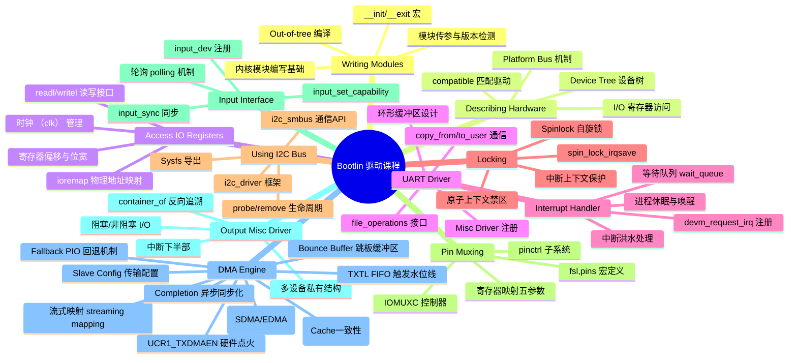
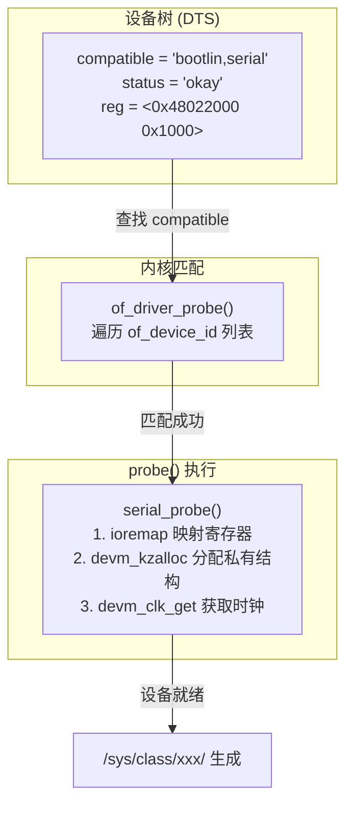
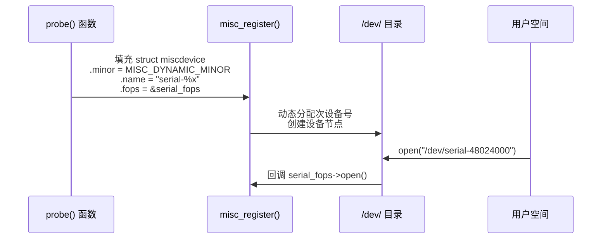
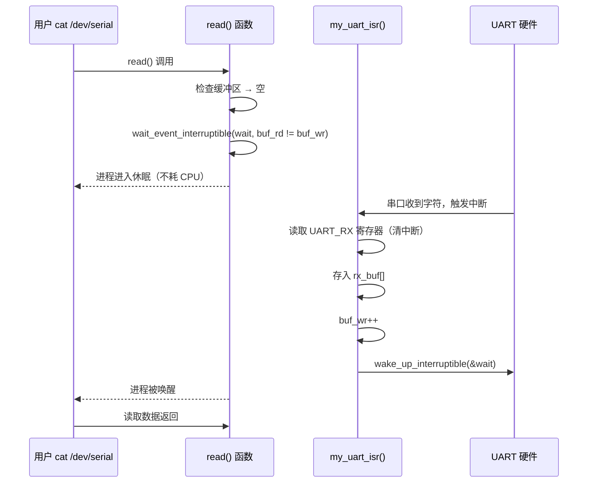
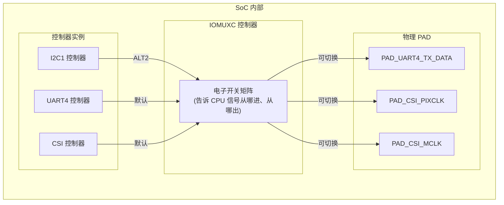
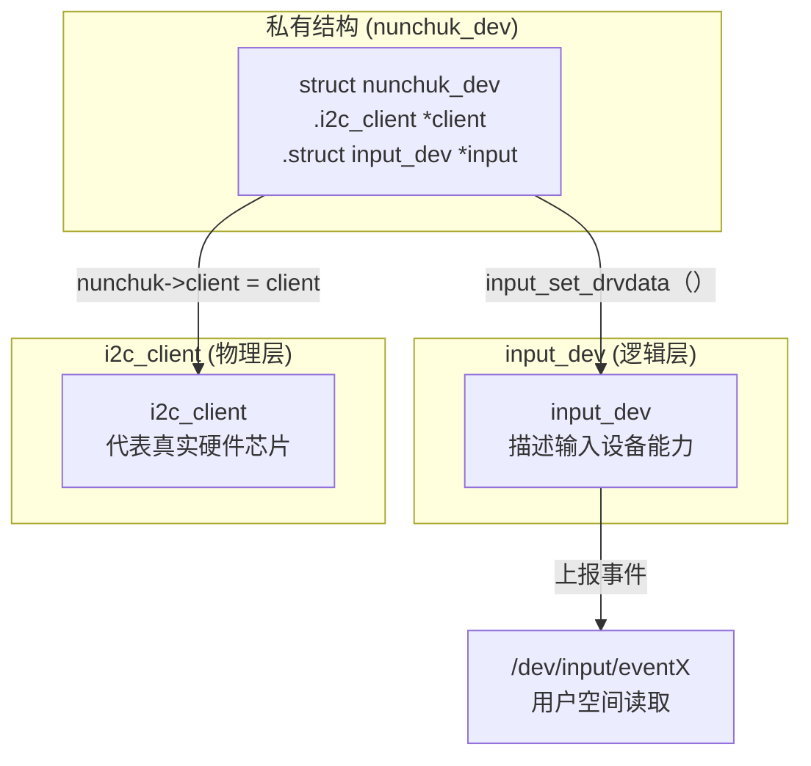
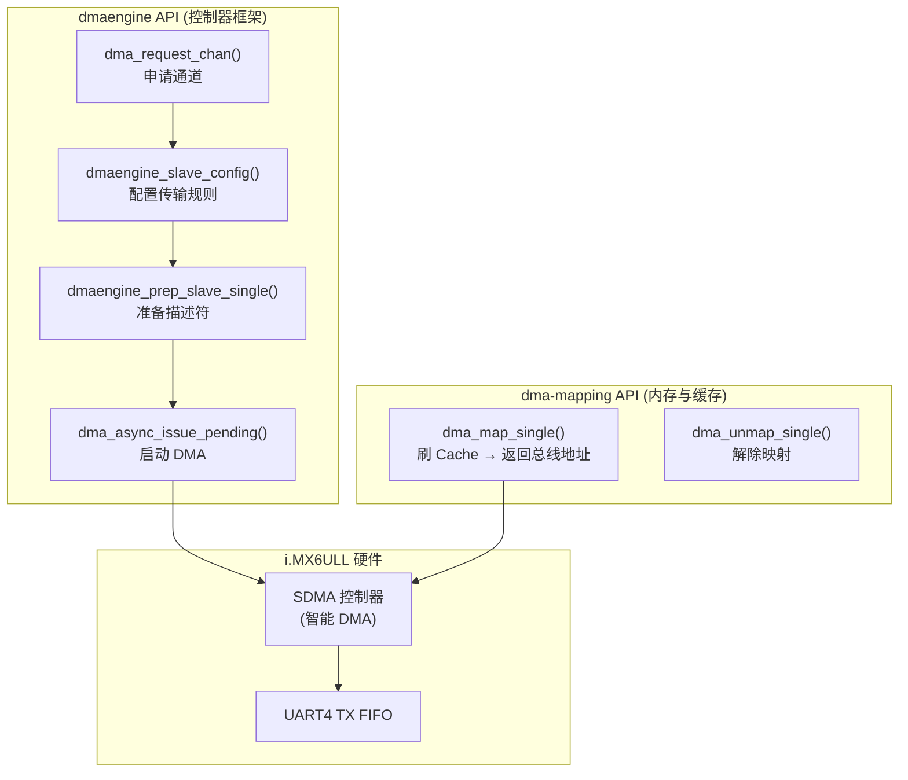
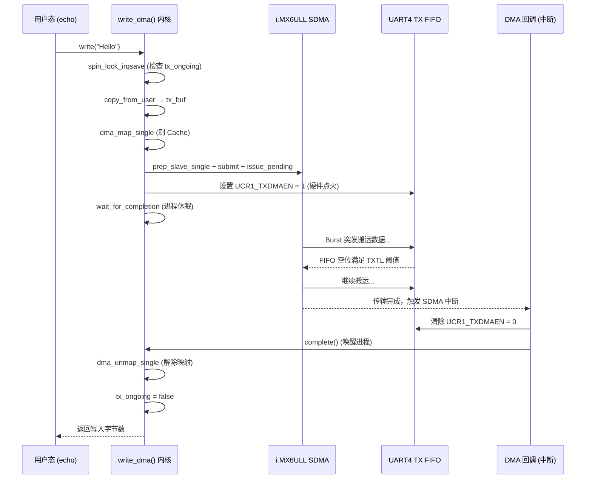
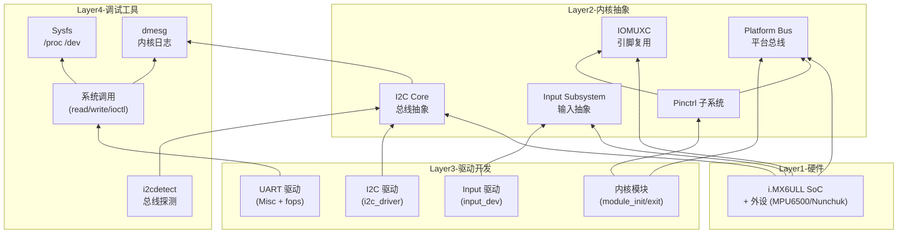
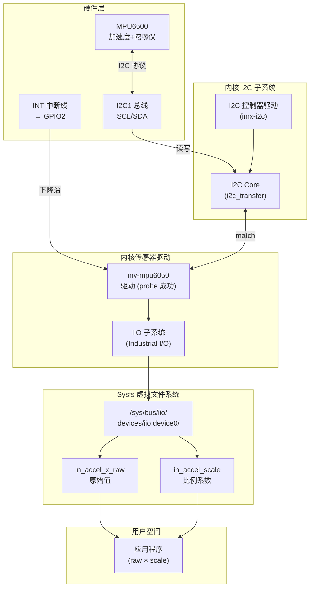

# Bootlin Linux Kernel & Driver Development Course — 实验总结

> 硬件平台：NXP i.MX6ULL (100ask Pro) | 交叉编译：WSL2 + arm-buildroot-linux-gnueabihf-gcc
> 课程来源：Bootlin "Linux kernel and driver development course"

---

## 一、课程全景知识图谱



---

## 二、实验分章详解

### 2.1 Writing Modules — 内核模块编写

**核心目标：** 编写第一个 "Hello World" 内核模块，掌握模块化编程基础。

**关键知识点：**

1. **`__init` / `__exit` 宏**：标记的函数在初始化完成后内存被释放，节省内核空间。
2. **`pr_info()` vs `printk()`**：现代内核推荐前者，代码更简洁。
3. **运行时版本获取**：必须使用 `utsname()->release`，不能直接用 C 宏（面试高频考点）。

```c
// 正确做法：运行时获取
pr_info("Hello World. Linux %s\n", utsname()->release);

// 错误做法：仅用编译时宏
// pr_info("Linux %s\n", LINUX_VERSION_CODE);  // 编译时确定，不反映运行时
```

**Out-of-tree 编译 Makefile 核心逻辑：**


**验证命令：**
```bash
file hello_version.ko    # 确认为 ARM ELF 文件
insmod hello_version.ko  # 上板加载
dmesg | tail             # 查看输出
```

---

### 2.2 Describing Hardware Devices — 描述硬件设备

**核心目标：** 理解 Platform Bus 与 Device Tree 的配合机制。

**Platform Bus 工作流程：**



**关键 API：**
| 函数 | 作用 |
|------|------|
| `platform_get_resource()` | 从设备树获取内存/IQR 资源 |
| `devm_ioremap_resource()` | 物理地址映射为虚拟地址 |
| `devm_clk_get()` | 获取时钟（i.MX6ULL 需 ipg + per 两个时钟） |
| `of_match_ptr()` | 安全匹配宏（防止未定义报错） |

---

### 2.3 Access IO Registers and UART — 访问I/O寄存器与UART

**核心目标：** 掌握通过 `readl`/`writel` 直接操作硬件寄存器，以及 Misc Character Driver 接口。

**I/O 映射与寄存器读写：**

```c
// 物理地址 -> 虚拟地址映射
void __iomem *regs = devm_ioremap_resource(&pdev->dev, res);

// 寄存器读写（i.MX6ULL UART 寄存器按 32-bit 对齐）
static void uart_putc(struct serial_dev *dev, char c) {
    writel(c, dev->regs + (UART_THR << 2));  // 左移2位 = 乘4
}
```

**Misc Driver 注册全流程：**



**私有数据回溯（container_of 魔法）：**

```c
// file_operations 的 open() 只收到 file*，如何找到 dev 结构？
static int serial_open(struct inode *inode, struct file *file) {
    struct miscdevice *mdev = file->private_data;
    struct serial_dev *dev = container_of(mdev, struct serial_dev, miscdev);
    // 现在可以访问 dev->regs 了
}
```

---

### 2.4 Registering Interrupt Handler and Sleep — 中断注册与进程休眠

**核心目标：** 实现从"轮询"到"事件驱动"的跨越。

**中断 + 等待队列协作模型：**



**关键原则：**
- 中断洪水：读取 `UART_RX` 自动清除接收中断标志
- `wait_event_interruptible` vs `wait_event`：前者可被信号中断（Ctrl+C），后者不可
- 中断上下文**绝对不能休眠**（不能调用 `copy_to_user` 等）

---

### 2.5 Locking — 并发保护（自旋锁）

**核心目标：** 保护环形缓冲区和寄存器访问，防止竞态条件。

**为什么用 Spinlock 而不是 Mutex？**

| 维度 | Spinlock | Mutex |
|------|----------|-------|
| 持有锁时休眠 | **不允许** | 允许 |
| 适用场景 | **中断上下文** | 进程上下文 |
| 获取失败行为 | 自旋（忙等） | 睡眠（调度） |
| 死锁风险 | 低（配合 irqsave） | 中 |

**正确加锁模式：**

```c
// ISR 中：使用 spin_lock（中断上下文本身已禁止抢占）
static irqreturn_t my_uart_isr(int irq, void *dev_id) {
    spin_lock(&dev->lock);
    // 访问共享 Buffer 和寄存器
    spin_unlock(&dev->lock);
    return IRQ_HANDLED;
}

// read() 中：使用 spin_lock_irqsave（禁止本地 CPU 中断，防止死锁）
ssize_t my_uart_read(struct file *file, char __user *buf, ...) {
    unsigned long flags;
    spin_lock_irqsave(&dev->lock, flags);
    // 从 Buffer 取数据到局部变量
    spin_unlock_irqrestore(&dev->lock, flags);
    // copy_to_user 必须放在锁外面！
    copy_to_user(buf, &tmp, 1);
    return 1;
}
```

**`CONFIG_DEBUG_ATOMIC_SLEEP` 照妖镜：** 持锁期间调用可能休眠的函数（如 `copy_to_user`、`kmalloc(GFP_KERNEL)`），内核会直接报 `BUG`。

---

### 2.6 Using the I2C Bus — I2C 总线驱动

**核心目标：** 编写 i2c_driver，掌握 I2C 子系统的通信机制。

**I2C 驱动框架：**

```c
static const struct i2c_device_id nunchuk_id[] = {
    { "nunchuk", 0 }, { }
};

static struct i2c_driver nunchuk_driver = {
    .probe    = nunchuk_probe,
    .remove   = nunchuk_remove,
    .driver.name = "nunchuk",
    .id_table = nunchuk_id,
};
module_i2c_driver(nunchuk_driver);
```

**I2C 通信 API：**

```c
// SMBus 协议（最常用）
i2c_smbus_read_byte_data(client, register_addr);
i2c_smbus_write_byte_data(client, register_addr, value);
i2c_smbus_read_i2c_block_data(client, register_addr, len, buf);

// 原始 I2C
i2c_master_send(client, buf, count);
i2c_master_recv(client, buf, count);
```

---

### 2.7 Pin Muxing — 引脚复用（跨平台移植：TI AM335x → NXP i.MX6ULL）

**核心目标：** 从零配置 i.MX6ULL 的 IOMUXC，将任意引脚复用为 I2C 总线。

这是本课程中**跨平台差异最大**的实验。从 TI AM335x (`pinctrl-single`) 移植到 NXP i.MX6ULL (`fsl,imx6ul-iomuxc`)。

**引脚复用"立交桥"模型：**



**NXP 引脚宏定义的五参数：**

```c
#define MX6UL_PAD_CSI_PIXCLK__I2C1_SCL  0x01d8 0x0464 0x05a4 3 2
//       ↑物理PAD名        ↑MUX偏移  ↑PAD偏移  ↑输入路由偏移  ↑MUX_MODE  ↑Daisy
```

| 参数 | 值 | 含义 |
|------|-----|------|
| 1 | 0x01d8 | MUX 寄存器偏移 — 设定功能模式 |
| 2 | 0x0464 | PAD 寄存器偏移 — 设定电气属性（上拉/开漏） |
| 3 | 0x05a4 | SELECT_INPUT 偏移 — 解决多路信号源冲突 |
| 4 | 3 | MUX_MODE = ALT3 = I2C1 功能 |
| 5 | 2 | Daisy Chain 输入选择值 |

**设备树最终配置：**

```dts
/* 1. 禁用原占引脚的 UART6 */
&uart6 {
    status = "disabled";
};

/* 2. 在 iomuxc 中定义引脚组（必须满足双层结构！） */
&iomuxc {
    my_board_grp {
        pinctrl_my_i2c1: my_i2c1grp {
            fsl,pins = <
                /* CSI 引脚复用为 I2C1，0x4001b8b1 包含开漏+上拉+SION */
                MX6UL_PAD_CSI_PIXCLK__I2C1_SCL 0x4001b8b1
                MX6UL_PAD_CSI_MCLK__I2C1_SDA   0x4001b8b1
            >;
        };
    };
};

/* 3. 绑定到 I2C1 控制器 */
&i2c1 {
    /delete-property/ pinctrl-0;     /* 删除原厂配置，防止合并冲突 */
    /delete-property/ pinctrl-names;
    pinctrl-names = "default";
    pinctrl-0 = <&pinctrl_my_i2c1>;
    status = "okay";

    mpu6500@68 {
        compatible = "invensense,mpu6500";
        reg = <0x68>;                  /* 必须加 0x 前缀！DTS 默认十六进制 */
        interrupt-parent = <&gpio2>;
        interrupts = <0 2>;              /* GPIO2 Pin0，下降沿触发 */
    };
};
```

**踩过的坑（NXP 专属）：**

| 错误 | 正确 | 原因 |
|------|------|------|
| `MX6ULL_PAD_...` | `MX6UL_PAD_...` | i.MX6ULL 共用 i.MX6UL 的 pinfunc 头文件 |
| `reg = <68>` | `reg = <0x68>` | DTS 默认十六进制，68 → 0x44（错地址）|
| `pinctrl_xxx` 直接放 `&iomuxc` 下 | 必须包一层容器节点 | NXP pinctrl 驱动要求**双层目录结构** |
| 只写一个 `&i2c1` | 加 `/delete-property/` | 原厂 `.dts` 中已有 `pinctrl-0`，合并后冲突 |
| `&iomuxc{` | `&iomuxc {` | DTC 编译器对空格要求极严 |

**SION 位的重要性：** `0x4001b8b1` 中的 `0x40000000`（第30位）是 SION (Software Input On)。I2C 控制器发送数据时需要回读总线电平检测仲裁丢失和 ACK，若未置位 SION，控制器会变成"瞎子"，报 Timeout 或 Arbitration lost。

---

### 2.8 Input Interface — 输入子系统

**核心目标：** 将 I2C 设备（Nunchuk）注册为标准 Linux 输入设备。

**私有数据结构 — 分层架构的粘合剂：**



**轮询模式（无中断引脚时）：**

```c
// 无硬件中断 → 使用 input_setup_polling 定时轮询
input_setup_polling(input, nunchuk_poll);
input_set_poll_interval(input, 50);  // 每 50ms 轮询一次

static void nunchuk_poll(struct input_dev *input) {
    struct nunchuk_dev *n = input_get_drvdata(input);
    // 通过 n->client 读取 I2C 寄存器
    i2c_smbus_read_i2c_block_data(n->client, 0x00, 6, buf);
    // 上报按键事件
    input_report_key(input, BTN_C, !(buf[5] & (1 << 1)));
    input_sync(input);  // 必须同步！
}
```

---

### 2.9 Output-only Misc Driver — 输出型杂项驱动

**核心目标：** 完善 write/read/ioctl 接口，实现用户空间与内核的双向通信。

**换行符处理（`\n` → `\n\r`）：** Linux 终端中 `\n` 只换行不回车，串口通信需手动补 `\r`。

```c
for (i = 0; i < count; i++) {
    get_user(c, buf + i);
    uart_putc(dev, c);
    if (c == '\n')
        uart_putc(dev, '\r');  // 补回车符
}
```

---

### 2.10 I2C Device Detection — I2C 设备探测

**`i2cdetect` 结果解读：**

| 输出 | 含义 |
|------|------|
| `UU` | 设备被内核驱动占用 — **驱动加载成功** |
| `68` | 硬件存在但无驱动匹配 |
| `--` | 总线配置通但无设备响应 |
| `xx` | 设备响应但无对应驱动（孤儿设备）|

**排查三层法：**
1. **软件层**：驱动/设备树/bus 配置 — `dmesg | grep i2c`
2. **物理层**：接线/电源/电平 — 万用表/逻辑分析仪
3. **协议层**：地址匹配/时序 — 示波器/I2C 协议分析仪

---

### 2.11 DMA Engine — 直接内存访问与异步传输

**核心目标：** 掌握 Linux DMA 子系统，将 UART 驱动从 PIO（CPU 逐字节搬运）升级为 DMA（SDMA 控制器自动搬运），彻底解放 CPU。

#### 2.11.1 为什么需要 DMA？

| 模式 | CPU 角色 | 效率 | 适用场景 |
|------|----------|------|----------|
| PIO | 逐字节轮询/中断读写 | 低（CPU 等待 IO） | 小数据、低频率 |
| DMA | 指挥 + 等待完成 | 高（CPU 可并行工作） | 大数据、高频率 |

**比喻：** DMA = 雇佣专业物流公司。CPU 只需填快递单（描述符），然后去干别的，数据由 SDMA 控制器自动从内存搬到外设。

#### 2.11.2 Linux DMA 两大子系统



#### 2.11.3 跨平台核心差异：TI vs NXP

| 维度 | TI OMAP (Bootlin 原版) | NXP i.MX6ULL (适配版) |
|------|------------------------|------------------------|
| 触发机制 | 需手动写第一个字节"踢"DMA | 设置 UCR1_TXDMAEN 自动触发 |
| DMA 控制器 | EDMA | SDMA (Smart DMA) |
| 寄存器位 | 不同 | **UCR1 bit 3 = TXDMAEN** (已验证手册) |
| TXTL 水位线 | 不涉及 | UFCR 寄存器控制 FIFO 触发阈值 |
| Burst 配置 | 不涉及 | dst_maxburst = 16（最优） |

**NXP 的关键位（已通过手册验证）：**
```c
#define UCR1_TXDMAEN (1 << 3)   // i.MX6ULL: bit 3
#define UCR1_RXDMAEN (1 << 2)   // 接收 DMA 使能（未来扩展用）
```

#### 2.11.4 流式映射与 Cache 一致性（最核心难点）

**问题链：**
```
copy_from_user() 数据 → 写入 CPU L1/L2 Cache（未到 DDR）
     ↓
SDMA 控制器从 DDR 读数据 → 读到的是旧数据（垃圾数据）→ 串口发出乱码
```

**破局：dma_map_single 执行 Cache Clean**
```c
dma_addr = dma_map_single(dev->dev, tx_buf, len, DMA_TO_DEVICE);
// 底层：强制将 CPU Cache 中的数据刷入 DDR
// 返回值：SDMA 认得的"总线物理地址"
```

**映射铁律：**
1. `dma_map_single` 后、 `dma_unmap_single` 前，**禁止 CPU 读写 tx_buf**
2. 发送用 `DMA_TO_DEVICE`（Clean），接收用 `DMA_FROM_DEVICE`（Invalidate）
3. 必须成对出现，有 Map 必有 Unmap

#### 2.11.5 完整 DMA Write 执行流



#### 2.11.6 设备树 DMA 配置

```dts
&uart4 {
    dmas = <&sdma 34 4 0>, <&sdma 35 4 0>;
    dma-names = "rx", "tx";
    status = "okay";
};
```

其中 `35` 是 i.MX6ULL UART4 TX 的 SDMA 事件号（需对照 NXP Reference Manual）。

#### 2.11.7 Fallback 回退机制

```c
ret = my_uart_init_dma(pdev, my_dev);
if (ret == 0) {
    my_dev->miscdev.fops = &my_uart_fops_dma;  // DMA 模式
} else {
    my_dev->miscdev.fops = &my_uart_fops;       // 回退 PIO 模式
}
```

即使 DMA 初始化失败（如设备树未配置 `dmas`），设备依然可用，保证鲁棒性。

#### 2.11.8 TXTL 水位线与 dst_maxburst 关系

| TXTL 值 | FIFO 空位 | 触发时机 | dst_maxburst 安全上限 |
|---------|-----------|----------|---------------------|
| 2 | 30 | 快空时才要货 | ≤ 30 |
| 16 | 16 | 空一半时报饿 | ≤ 16（推荐）|
| 31 | 1 | 有位就立刻要 | 只能 1 |

`TXTL = 16` + `dst_maxburst = 16` 是 i.MX6ULL UART 的最优配置。

---

## 三、知识关联总图



---

## 四、i2cdetect UU 状态 — 数据流向完整链路

当 `i2cdetect -y 0` 显示 `UU`（MPU6500 驱动成功加载）时，数据从硬件到用户空间的完整路径：



**真实数据换算：**
```
真实加速度 (m/s²) = in_accel_x_raw × in_accel_scale
例如: 16384 × 0.000598 ≈ 9.8 m/s² (1G 重力)
```

---

## 五、核心知识点

### 5.1 模块与内核
- `__init` 标记的函数在初始化完成后**内存被释放**
- `pr_info` vs `printk`：前者是后者的现代简化写法
- `insmod` vs `modprobe`：**modprobe** 能自动解析模块依赖 (`modules.dep`)

### 5.2 设备树
- `compatible` 字符串是驱动匹配的"钥匙"
- `#include "xxx.dts"` 包含完整文件（含根节点），`#include "xxx.dtsi"` 是模板
- `/delete-property/` 可强制删除被合并覆盖的属性

### 5.3 中断与锁
- 中断上下文**不能休眠**，只能使用 `spin_lock`（非 irqsave 版本）
- 进程上下文使用 `spin_lock_irqsave`，禁止中断防止死锁
- `copy_to_user` / `kmalloc(GFP_KERNEL)` **不能在持锁期间调用**

### 5.4 I2C 与 Pin Muxing
- I2C 必须是**开漏 + 上拉**：发 1 = 断开（高阻），由上拉电阻拉高
- NXP pinctrl 驱动要求**双层目录**结构
- SION 位（`0x40000000`）让 I2C 控制器能回读总线状态

### 5.5 Input 子系统
- `input_sync()` 标记一批事件上报完成，**必须调用**
- `input_set_drvdata()` 建立 input_dev 到私有数据的"桥梁"
- 无中断设备用 `input_setup_polling()` 实现轮询

### 5.6 DMA 与 Cache 一致性
- `dma_map_single` 对发送执行 **Cache Clean**（刷入 DDR）
- `dma_unmap_single` 对接收执行 **Cache Invalidate**（让 CPU 重新读 DDR）
- 流式映射期间，**CPU 禁止读写缓冲区**（会导致 Cache 污染）
- `dma_request_chan` 返回错误指针而非 NULL，必须用 `IS_ERR()` 检查
- `UCR1_TXDMAEN = (1 << 3)` 是 i.MX6ULL UART 的 DMA 触发位（TI 平台用 bit 14）
- `TXTL` 水位线决定 UART 何时向 SDMA 发起请求，`dst_maxburst` 必须 ≤ 空位数量

---

## 六、踩坑经验汇总

| # | 场景 | 错误表现 | 根因 | 解决方案 |
|---|------|----------|------|----------|
| 1 | `reg = <68>` | 驱动找不到设备 | DTS 默认十六进制，68 → 0x44 | 改为 `reg = <0x68>` |
| 2 | 宏拼写 `MX6ULL_` | 编译 FATAL ERROR | 头文件用 `MX6UL_`，不是 `MX6ULL_` | 使用 `MX6UL_PAD_...` |
| 3 | pinctrl 直接放 `&iomuxc` 下 | `no groups defined` | NXP 驱动要求双层嵌套 | 包一层容器节点 |
| 4 | `#include "full.dts"` 含根节点 | 属性合并冲突 | 原厂 + 自己的 pinctrl-0 冲突 | 加 `/delete-property/` |
| 5 | 持 spinlock 调 `copy_to_user` | `BUG: sleeping in atomic` | 持锁进入原子上下文，不能休眠 | 将 copy 移到锁外 |
| 6 | DTB 文件名不匹配 U-Boot | 设备树不生效 | 编译名 ≠ U-Boot 加载名 | `cat /sys/firmware/devicetree/base/model` 验证 |
| 7 | UART 寄存器偏移 | 数据错误 | ARM 32-bit 对齐，偏移需 ×4 | `reg << 2` |
| 8 | DMA 申请失败导致死锁 | 所有 write 调用永久 -EBUSY | 错误路径未置 `tx_ongoing = false` | `goto err_out` 中必须重置标志位 |
| 9 | DMA 回调忘关 TXDMAEN | SDMA 报 Request Error | 传输结束但 UART 仍向 SDMA 发无效请求 | 回调中必须 `&= ~UCR1_TXDMAEN` |
| 10 | TI DMA 逻辑用于 NXP | DMA 不启动 | TI UART 需"踢"第一个字节；NXP 不需要 | 确认平台，删除 Kickstart 逻辑 |

---

*文档生成时间：2026-04-07 | 基于 Bootlin Linux Kernel and Driver Development Course 实验记录*
