# Bootlin Linux Kernel & Driver Development Course — 实验总结

> 硬件平台：NXP i.MX6ULL (100ask Pro) | 内核版本：Linux 4.9.88
> 交叉编译：WSL2 + arm-linux-gnueabihf-gcc
> **所有内容基于本人实际编写的代码，非 Bootlin 原版示例**

---

## 一、课程全景知识图谱

```mermaid
mindmap
  root((Bootlin 驱动课程))
    01-Writing Modules
      双遍 Makefile 编译原理
      module_param sysfs 导出
      ktime_get_seconds 运行时统计
      utsname（）->release 内核版本
    02-Describing Hardware
      &{/leds} 节点覆盖
      &led0 心跳灯配置
      &i2c1 mpu6500@68 声明
      interrupt-parent GPIO 中断
    03-Pin Multiplexing
      pinctrl 两级节点结构
      0x4001b8b1 开漏 pad 配置
      CSI I2C1 SCL/SDA 复用
      /delete-property/ 删除继承
    04-Using I2C Bus
      i2c_driver probe/remove 模型
      i2c_transfer burst read 两消息协议
      WHO_AM_I 寄存器验证
      Big-Endian 数据组装
    05-Input Interface
      input_polled_dev 轮询框架
      EV_ABS 绝对坐标事件
      Bridge: I2C 物理层 → input 逻辑层
    06-Accessing IO Memory
      devm_ioremap_resource 内存映射
      时钟框架 clk_prepare_enable
      波特率公式 UBIR/UBMR
      cpu_relax 超时保护
    07-Output Misc Driver
      misc_register 动态设备号
      container_of 反向追溯
      \n → \r\n 换行转义
    08-Sleeping Interrupts
      devm_request_irq ISR 注册
      ISR + Ring Buffer 生产者/消费者
      wait_event_interruptible 阻塞
      UCR3_RXDMUXSEL 硬件 quirk
    09-Locking
      spin_lock_irqsave vs spin_lock
      持锁禁止休眠规则
      三明治原则
    10-DMA
      dma_request_chan SDMA 通道
      dma_map_resource FIFO 地址
      dma_map_single Cache 同步
      tx_ongoing 防竞争标志
      EPROBE_DEFER / PIO 回退
```

---

## 二、实验分章详解

### 01 Writing Modules — 内核模块编写

**核心目标：** 掌握 Out-of-tree 内核模块的编译方式和模块参数机制。

**Out-of-tree 双遍 Makefile 原理：**

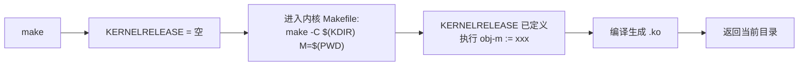

**关键设计点：**
- `module_param(whom, charp, 0644)` → `/sys/module/hello_version/parameters/whom`
- `ktime_get_seconds()` + `time64_t` → 防止 Y2038 问题
- `utsname()->release` → **运行时**获取内核版本，不用编译期宏

---

### 02 Describing Hardware Devices — 设备树节点覆盖

**核心目标：** 用 `&label` 语法覆盖已有设备树节点，声明 MPU6500 和配置 LED。

**覆盖语法体系：**

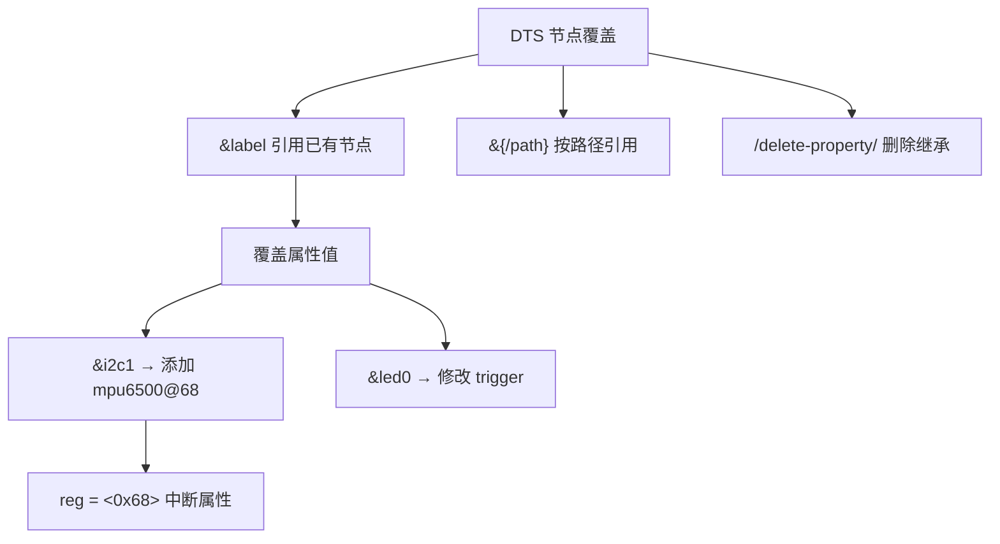

**关键设计点：**
- `compatible = "invensense,mpu6500"` → 匹配内核内置驱动（无需自写驱动）
- `interrupt-parent = <&gpio2>` → 指定 GPIO2 为中断控制器
- `interrupts = <0 IRQ_TYPE_EDGE_RISING>` → GPIO2 第 0 号引脚，上升沿

---

### 03 Configuring Pin Multiplexing — pinctrl 两级结构

**核心目标：** 理解 NXP i.MX6ULL pinctrl 子系统的两级节点结构，并通过 pad 配置实现 I2C 开漏引脚。

**NXP pinctrl 两级结构（关键！）：**

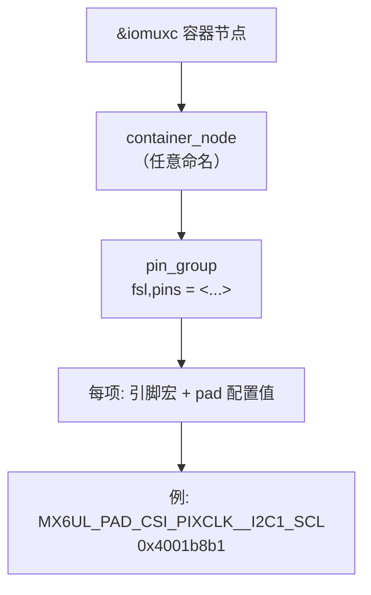

> 无 container_node 时，NXP pinctrl 驱动返回 `-EINVAL`

**`0x4001b8b1` pad 配置解构：**

| 位段 | 值 | 含义 |
|------|----|------|
| bit 31 SION | 1 | Software Input On（强制输入） |
| bit 14 ODE | 1 | **Open Drain Enable，I2C 必须** |
| bit 12 PKE | 1 | Pull / Keeper Enable |
| bit 11 PUE | 1 | Pull Selected（非 Keeper） |
| bit 8 HYS | 1 | Hysteresis Enable |

**开漏原理（I2C 线与逻辑）：**

```
总线高：所有设备释放（接上拉电阻）→ 线为高
总线低：任一设备拉低 → 线为低
 → 实现无竞争的多主仲裁
```

**冲突解决：**

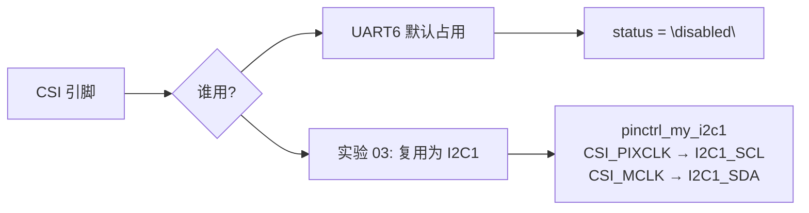

---

### 04 Using the I2C Bus — i2c_driver 与 burst read

**核心目标：** 掌握 Linux I2C 子系统的两消息 burst read 协议，理解 WHO_AM_I 硬件验证和 Big-Endian 数据组装。

**i2c_driver 驱动模型：**

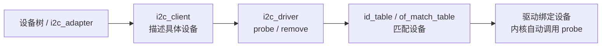

**两消息 burst read 协议：**

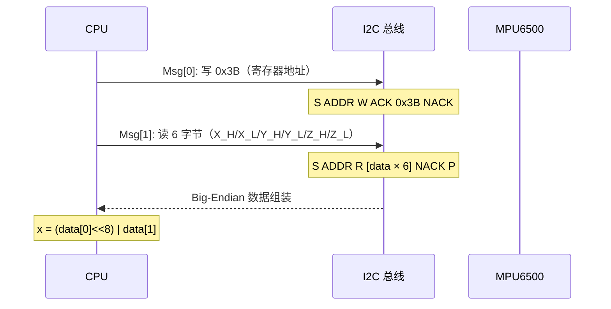

**Big-Endian vs Little-Endian：**

```
MPU6500 输出: data[0]=0x01, data[1]=0xA3
实际值:      0x01A3 = 419（高字节在前）

若按小端解读: 0xA301 = 43009 ❌
必须按:      (data[0] << 8) | data[1] ✓
```

**WHO_AM_I 验证流程：**

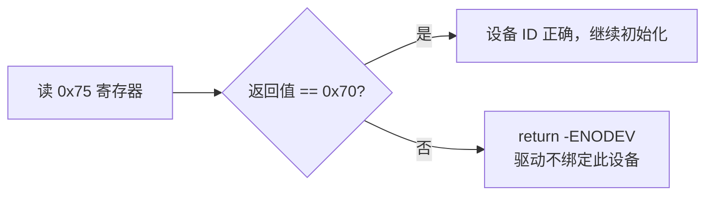

---

### 05 Input Interface — input_polled_dev 桥接层

**核心目标：** 理解 Linux input 子系统的抽象层次，将 I2C 物理层桥接为标准 input 事件。

**四层抽象模型：**

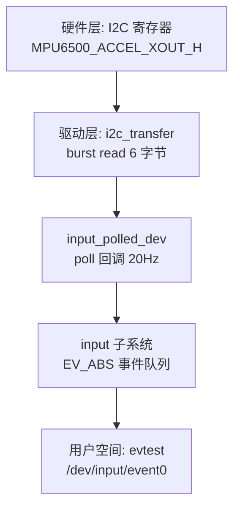

**EV_ABS 事件报告序列：**

```
input_report_abs(input, ABS_X, ax)  ─┐
input_report_abs(input, ABS_Y, ay)  ─┤ 一帧事件
input_report_abs(input, ABS_Z, az)  ─┘
input_sync()                          帧结束标志
```

**关键设计点：**
- `poll_interval = 50` → 50ms = 20Hz，内核工作队列调度
- `devm_*` 函数 → 设备 remove 时自动释放，无需手动 cleanup
- `input_set_abs_params(input, ABS_X, -32768, 32767, 8, 0)` → 定义轴范围，驱动事件规范化

---

### 06 Accessing I/O Memory and Ports — 内存映射与时钟框架

**核心目标：** 掌握平台设备的内存映射 I/O 方式和时钟框架，理解 UART 波特率计算原理。

**地址映射体系：**

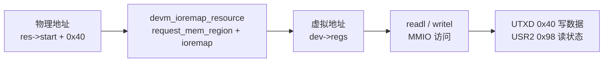

**时钟框架时序：**

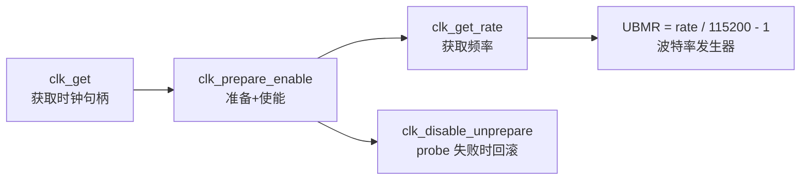

**波特率公式（i.MX6ULL 参考手册）：**

```
         per_clk
BAUD = -----------
       16 × (UBMR + 1)

反推: UBMR = per_clk / (BAUD × 16) - 1
    = per_clk / 115200 - 1

UBIR = 15（整数部分，通常固定）
```

**超时保护模式：**

```c
timeout = 1000000;
while (!(readl(USR2) & TXFE) && --timeout)
    cpu_relax();   // 提示编译器: 忙等，可优化寄存器重读
```

> 无超时保护时，TX FIFO 硬件卡死将导致内核永久挂起

---

### 07 Output-only Misc Driver — container_of 与跨空间数据交换

**核心目标：** 掌握 Misc 设备框架、`container_of` 反向追溯和 `copy_from_user` 跨空间数据交换。

**container_of 反向追溯原理：**

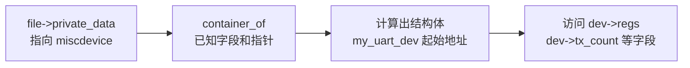

```c
// file->private_data 指向 miscdevice
// miscdevice 是 my_uart_dev 的第一个成员
// 故 container_of 计算结果就是 my_uart_dev 本身
struct my_uart_dev *dev = container_of(file->private_data,
                                         struct my_uart_dev, miscdev);
```

**write 数据流：**

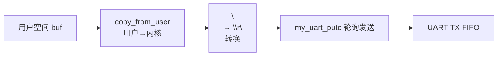

**put_user vs copy_to_user：**

| API | 适用场景 | 重量 |
|-----|---------|------|
| `put_user(x, ptr)` | 单字节/单字写回 | 轻量 |
| `get_user(x, ptr)` | 单字节/单字读取 | 轻量 |
| `copy_to_user(dst, src, n)` | 任意长度 | 重量（可睡眠） |

---

### 08 Sleeping and Handling Interrupts — ISR + Ring Buffer + Wait Queue

**核心目标：** 掌握中断驱动的 RX 模型，理解 ISR 与进程上下文之间的同步机制。

**生产者/消费者模型：**

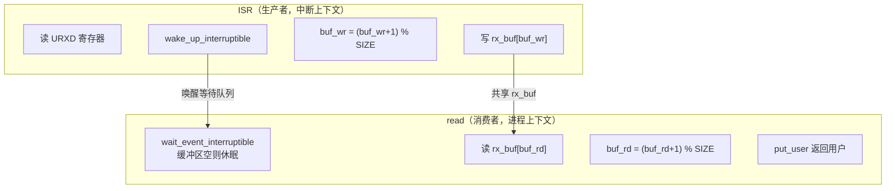

**环形缓冲区原理：**

```
SERIAL_BUFSIZE = 32

写指针: buf_wr（ISR 更新）
读指针: buf_rd（read 更新）
空条件: buf_rd == buf_wr
满条件: (buf_wr + 1) % SIZE == buf_rd
```

**自旋锁保护表：**

| 上下文 | 锁类型 | 保护对象 | 原因 |
|--------|--------|----------|------|
| ISR | `spin_lock` | `rx_buf`, `buf_wr` | 中断已禁止调度 |
| `read` | `spin_lock_irqsave` | `rx_buf`, `buf_rd` | 保存/恢复中断标志 |
| `write` | `spin_lock_irqsave` | `tx_count` | 同上 |

**UCR3_RXDMUXSEL 硬件 quirk：**

```
i.MX6ULL 数据手册规定:
bit 2 = 0: RX 信号来自内部测试回路（始终为 0）
bit 2 = 1: RX 信号路由至外部引脚 ← 必须置 1

症状: 中断触发，URXD 读回 0x00 → 漏设此位
```

---

### 09 Locking — 自旋锁与三明治原则

**核心目标：** 理解 spin_lock 在不同上下文的使用差异，掌握持锁期间的休眠禁忌。

**ISR vs 进程上下文用锁差异：**

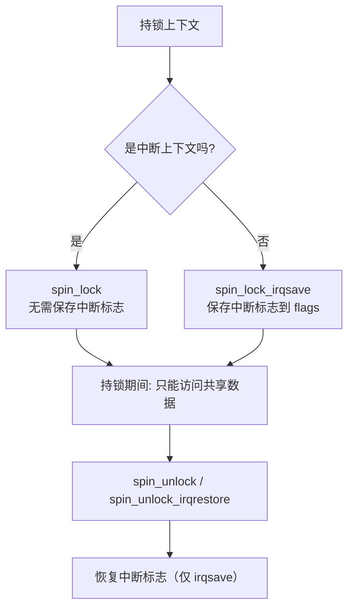

**为什么进程上下文必须用 irqsave：**

```
场景: 进程 A 获取锁（中断未禁止）
  → 中断触发 → ISR 抢占进程 A
  → ISR 尝试获取同一把锁
  → ISR 不能休眠 → 自旋等待
  → 进程 A 被 ISR 抢占无法运行
  → 死锁！

解决: spin_lock_irqsave 持锁时禁止本地 CPU 中断
```

**三明治原则（原子性保护）：**

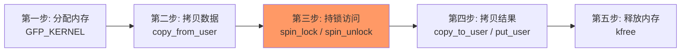

> `copy_to/from_user` 可能休眠，持锁期间调用会触发 `CONFIG_DEBUG_ATOMIC_SLEEP` BUG

**休眠 API 黑名单（持锁期间禁止）：**

```
kmalloc(GFP_KERNEL)     ← 可休眠，用 GFP_ATOMIC
copy_to/from_user        ← 可休眠
mutex_lock               ← 必然休眠
wait_event_interruptible ← 必然休眠
msleep                   ← 必然休眠
```

---

### 10 DMA — SDMA 引擎与 Cache 一致性

**核心目标：** 掌握 Linux DMA Engine API 链路，理解 Cache 一致性问题及其解决方案。

**DMA vs PIO 数据流对比：**

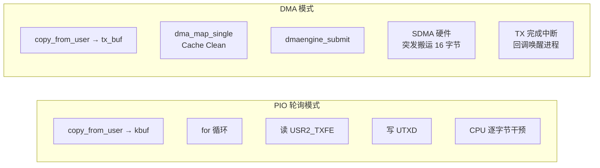

**Cache 一致性问题（最核心）：**

```
CPU 写入 tx_buf
    ↓
数据在 CPU L1/L2 Cache 中（未写回 DDR）
    ↓
SDMA 控制器从 DDR 读取（读到的仍是旧数据）
    ↓
串口发出乱码 ← 数据不一致
```

```
解决: dma_map_single
    ↓
强制将 Cache 中脏数据刷入 DDR
    ↓
SDMA 读取到正确数据 ✓
```

**映射铁律：**

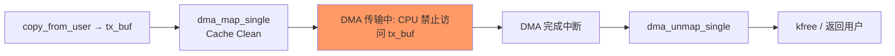

**DMA 引擎 API 链路：**

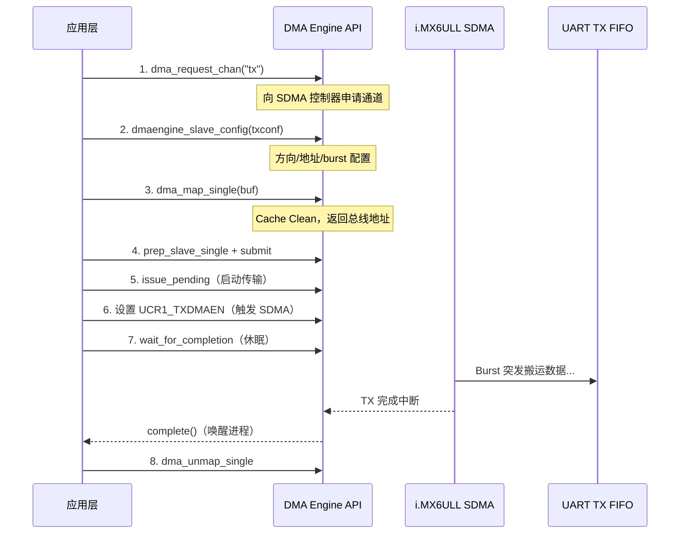

**TXTL 水位线与 burst 关系：**

| TXTL | FIFO 空位 | 触发时机 | 推荐 dst_maxburst |
|------|-----------|----------|------------------|
| 2 | 30 | 快空时才申请 | ≤ 30 |
| **16** | **16** | **空一半时申请** | **≤ 16（最优）** |
| 31 | 1 | 有空间即申请 | 只能 1 |

> `TXTL = 16` + `dst_maxburst = 16` 使 SDMA 和 UART FIFO 完美匹配，避免饥饿或溢出

**tx_ongoing 防竞争：**

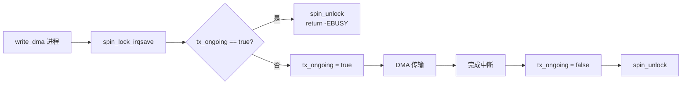

**PIO Fallback 鲁棒性设计：**

```mermaid
graph TD
    A["my_uart_init_dma"] --> B{"返回错误?"}
    B -->|EPROBE_DEFER| C["return ret<br>内核稍后重试 probe"]
    B -->|-ENODEV| D["dev_warn<br>初始化 PIO 模式"]
    B -->|0 成功| E["miscdev.fops = DMA 版本"]
    D --> F["miscdev.fops = PIO 版本"]
    C --> G["probe 成功<br>设备注册完成"]
    E --> G
    F --> G
```

---

## 三、知识关联总图

```mermaid
graph BT
    subgraph "Layer0-硬件"
        HW["i.MX6ULL SoC<br>MPU6500 加速度计"]
    end
    subgraph "Layer1-内核框架"
        IOMUX["IOMUXC<br>引脚复用控制器"]
        I2CCORE["I2C Core\n总线抽象层"]
        INPUTSUB["Input 子系统\nEV_ABS 事件"]
        PLATBUS["Platform Bus\n平台总线"]
        DMAENG["DMA Engine\nSDMA 控制器"]
    end
    subgraph "Layer2-本人驱动代码"
        MPU6500I2C["invensense_mpu6500_i2c.c<br>实验04"]
        MPU6500IN["invensense_mpu6500_input.c<br>实验05"]
        UART06["custom_uart.c probe<br>实验06"]
        UART07["custom_uart.c misc<br>实验07"]
        UART08["custom_uart.c ISR+WB<br>实验08"]
        UART10["custom_uart_dma.c<br>实验10"]
    end
    subgraph "Layer3-设备树"
        LED["&led0 心跳灯<br>实验02"]
        MPU6500DTS["mpu6500@68<br>实验02/03"]
        PINGRP["pinctrl_my_i2c1<br>实验03"]
        UARTDTS["my,custom-uart4<br>实验06~10"]
    end

    HW --> IOMUX
    HW --> I2CCORE
    HW --> DMAENG
    IOMUX --> PINCTRL["pinctrl 子系统"]
    PINCTRL --> PINGRP
    I2CCORE --> MPU6500I2C
    I2CCORE --> MPU6500IN
    INPUTSUB --> MPU6500IN
    PLATBUS --> UART06
    PLATBUS --> UART07
    PLATBUS --> UART08
    PLATBUS --> UART10
    DMAENG --> UART10
    PINGRP --> MPU6500DTS
    MPU6500DTS --> MPU6500I2C
    MPU6500DTS --> MPU6500IN
```

---

## 四、i2cdetect 结果解读

| 显示 | 含义 |
|------|------|
| `--` | 无设备响应此地址 |
| `00`–`6F` | 确认存在 I2C 从机 |
| `UU` | **有驱动占用**，设备正被内核驱动管理（正常） |
| `XX` | 检测到设备但响应异常 |

实验中 MPU6500 地址 `0x68` 正确注册后显示 `UU`。

---

## 五、核心知识点速查

### 5.1 模块与内核

| API | 关键点 |
|-----|--------|
| `module_init/exit` | 声明入口/退出 |
| `module_param` | sysfs 参数（`/sys/module/.../parameters/`） |
| `ktime_get_seconds()` | Y2038 安全时间统计 |
| `utsname()->release` | 运行时获取内核版本 |

### 5.2 设备树

| 语法 | 含义 |
|------|------|
| `&label` | 覆盖已有节点 |
| `&{/path}` | 按路径引用 |
| `/delete-property/` | 删除继承属性 |
| `interrupt-parent` | 指定中断控制器 |
| `status = "disabled"` | 禁用节点释放引脚 |

### 5.3 中断与锁

| 场景 | 锁类型 |
|------|--------|
| ISR 内 | `spin_lock` |
| 进程上下文（与 ISR 共用资源） | `spin_lock_irqsave` |
| 持锁期间 | 禁止 `GFP_KERNEL`/`copy_*_user` 等可休眠调用 |

### 5.4 I2C 与 Pin Muxing

| 概念 | 关键点 |
|------|--------|
| `i2c_driver` | probe/remove 模型 |
| `i2c_transfer` | 两消息 burst read |
| 两级 pinctrl | `container → group`（NXP 专用要求） |
| `0x4001b8b1` | SION+ODE+PKE+PUE+HYS，开漏上拉 |

### 5.5 Input 子系统

| API | 含义 |
|-----|------|
| `input_allocate_polled_device` | 分配轮询输入设备 |
| `poll_interval = 50` | 50ms = 20Hz |
| `EV_ABS` | 绝对坐标事件 |
| `input_sync` | 帧结束标志 |

### 5.6 DMA 与 Cache

| API | 含义 |
|-----|------|
| `dma_request_chan` | 申请 DMA 通道 |
| `dmaengine_slave_config` | 配置传输参数 |
| `dma_map_single` | 流式映射 + Cache Clean |
| `reinit_completion` | 每次 DMA 前必须重置 |
| `EPROBE_DEFER` | DMA 控制器未就绪，延迟探测 |

---

## 六、踩坑经验汇总

| # | 现象 | 原因 | 解决方案 |
|---|------|------|----------|
| 1 | `i2cdetect` 0x68 显示 `--` | `compatible` 不匹配 | 改为 `invensense,mpu6500` |
| 2 | WHO_AM_I 返回 `0xFF` | I2C 总线未初始化或引脚复用错误 | 检查实验 03 pinctrl 配置 |
| 3 | RX 始终收到 `0x00` | 缺少 `UCR3_RXDMUXSEL` | `reg \|= (1 << 2)` |
| 4 | DMA 后串口乱码 | Cache 未刷，数据未到 DDR | `dma_map_single` 后禁止 CPU 访问 buffer |
| 5 | 模块加载 oops | `IS_ERR` 未检查 | 所有指针 API 后加 `IS_ERR` 检查 |
| 6 | 波特率偏差大 | `per_clk / 115200` 溢出 | 用 `unsigned long` 并先除后减 |
| 7 | pinctrl 返回 `-EINVAL` | 缺少容器节点 | NXP 必须两级结构 |
| 8 | DMA 通道申请失败 | SDMA 控制器未就绪 | 返回 `EPROBE_DEFER` 而非 `-ENODEV` |
| 9 | 并发读写数据丢失 | 缺少自旋锁 | 对 `rx_buf`/`tx_count` 加锁 |
| 10 | `container_of` 计算错误 | `private_data` 类型不匹配 | 确认字段指针的来源结构体 |
