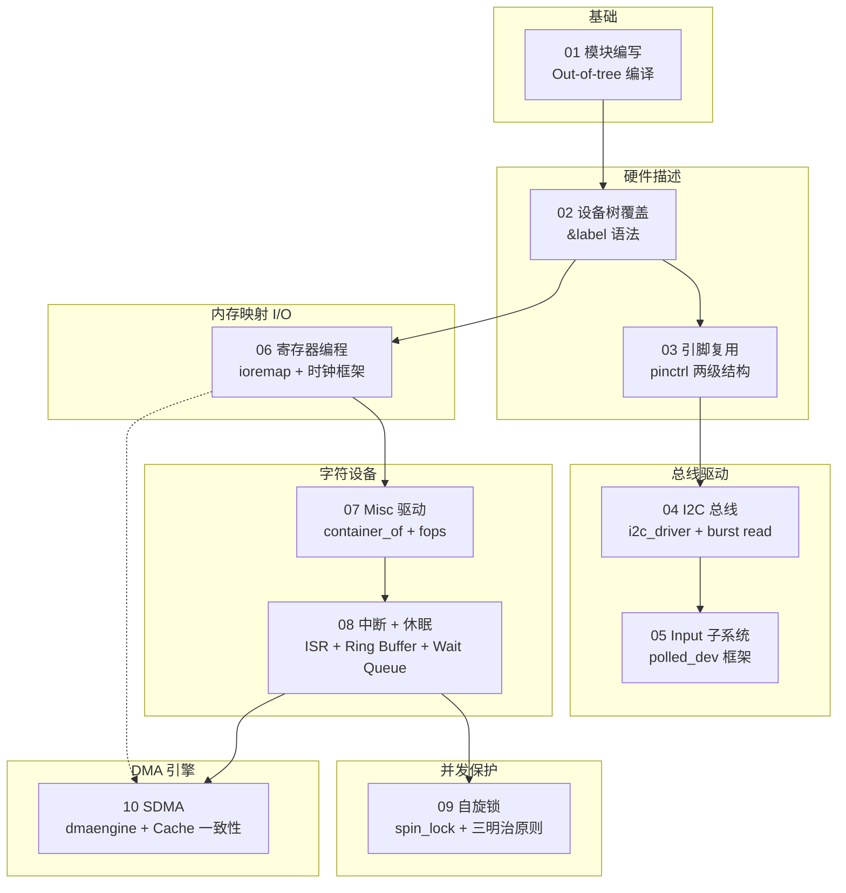

# linux-kernel-driver-labs

i.MX6ULL 嵌入式 Linux 内核驱动实验，共 10 个实验，覆盖内核模块编写、设备树、I2C 驱动、输入子系统、内存映射 I/O、字符设备、中断处理、锁机制和 DMA 引擎。

**硬件平台**：NXP i.MX6ULL (ARM Cortex-A7) + 100ask 开发板
**内核版本**：Linux 4.9.88
**工具链**：arm-linux-gnueabihf-gcc

---

## 实验索引

| # | 实验名称 | 核心知识点 | 状态 |
|---|----------|------------|------|
| 01 | [Writing Kernel Modules](01-writing-modules/) | 模块参数、module_init/exit、GPL 符号导出、ktime 时间统计 | ✅ |
| 02 | [Describing Hardware Devices](02-Describing-Hardware-Devices/) | &label 节点覆盖、GPIO LED、interrupt-parent、IRQ_TYPE | ✅ |
| 03 | [Configuring Pin Multiplexing](03-Configuring-Pin-Muxing/) | 两级 pinctrl 结构、开漏 pad 配置、SION 位、/delete-property/ | ✅ |
| 04 | [Using the I2C Bus](04-Using-the-I2C-Bus/) | i2c_driver、i2c_transfer burst read、WHO_AM_I 验证、Big-Endian | ✅ |
| 05 | [Input Interface](05-Input-Interface/) | input_polled_dev、EV_ABS、input_report_abs/input_sync | ✅ |
| 06 | [Accessing I/O Memory and Ports](06-Accessing-IO-Memory-and-Ports/) | ioremap、时钟框架、UART 寄存器、波特率公式、cpu_relax 超时保护 | ✅ |
| 07 | [Output-only Misc Driver](07-Output-only-Misc-Driver/) | Misc 设备框架、file_operations、container_of、copy_from_user、ioctl | ✅ |
| 08 | [Sleeping and Handling Interrupts](08-Sleeping-and-Handling-Interrupts/) | devm_request_irq、ISR、Ring Buffer、wait_event_interruptible | ✅ |
| 09 | [Locking](09-Locking/) | spin_lock/spin_lock_irqsave、原子上下文规则、三明治原则 | ✅ |
| 10 | [DMA](10-DMA/) | dmaengine API、dma_map_resource、Completion 同步、EPROBE_DEFER、PIO 回退 | ✅ |

---

## 知识演进路线



---

## 目录结构

```
linux-kernel-driver-labs/
├── 01-writing-modules/
│   ├── code/          # 驱动源码 + Makefile
│   ├── docs/          # 实验文档（含 Mermaid 图解）
│   └── assets/        # 截图/照片
├── 02-Describing-Hardware-Devices/
├── 03-Configuring-Pin-Muxing/
├── 04-Using-the-I2C-Bus/
├── 05-Input-Interface/
├── 06-Accessing-IO-Memory-and-Ports/
├── 07-Output-only-Misc-Driver/
├── 08-Sleeping-and-Handling-Interrupts/
├── 09-Locking/
├── 10-DMA/
├── Bootlin-实验总结.md   # 实验总结报告
├── LICENSE            # GPL-2.0
└── .gitignore
```

---

## 构建方法

```bash
# 安装交叉编译工具链
sudo apt install gcc-arm-linux-gnueabihf

# 设置内核源码路径后编译
export HOME=/home/your_user
# 在各实验的 code/ 目录执行：
make

# 设备树编译（实验 02/03）
make dtbs
```

---

## 硬件资源

| 资源 | 说明 |
|------|------|
| UART4 | 实验 06/07/08/10 的串口设备节点 `/dev/serial-21f0000` |
| I2C1 (CSI pins) | 实验 03/04/05 的 MPU6500 加速度计总线 |
| CSI pins (UART6 conflict) | 实验 03 将 I2C1 复用至此 |
| SDMA | 实验 10 的 NXP SDMA 控制器 |

---

## License

All kernel modules are licensed under **GPL-2.0**. See [LICENSE](LICENSE) for details.
